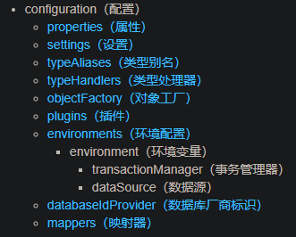

# MyBatis配置

---

MyBatis 的配置文件包含了会深深影响 MyBatis 行为的设置和属性信息。 配置文档的顶层结构如下：



## properties（属性）

作用：给系统配置运行参数。

使用方式：property子元素、properties文件、程序代码传递
为了给配置提供灵活性，可以使用properties文件与程序代码传递的方式完成配置。

### 子元素

示例

设置好的属性

```xml
<properties>
    <property name="driver" value="com.mysql.jdbc.Driver"/>
  	<property name="url" value="jdbc:mysql://localhost:3306/myDB"/>
    <property name="username" value="root"/>
  	<property name="password" value="123456"/>
</properties>
```

需要动态配置的属性值“value="${……}"

```xml
<dataSource type="POOLED">
    <property name="driver" value="${driver}"/>
  	<property name="url" value="${url}"/>
  	<property name="username" value="${username}"/>
  	<property name="password" value="${password}"/>
</dataSource>
```

如示例所示，设置好的属性可以在整个配置文件中用来替换需要动态配置的属性值。

### properties 文件

配置原理就是简单的“键值对应”，就是将原本在配置文件中设定的子元素抽离成一个properties文件的形式单独存在。

示例

创建一个jdbc.properties文件

```properties
driver=com.mysql.jdbc.Driver
url=jdbc:mysql://localhost:3306/myDB
username=root
password=123456
```

在MyBatis配置文件中引入properties文件

```xml
<properties resource="jdbc.properties"/>
```

### 程序代码传递

在build()方法中传入属性值。

```java
String resource = "mybatis-config.xml";
InputStream in = Resources.getResourceAsStream("jdbc.properties");
Properties props = new Properties;
props.load(in);
InputStream inputStream = Resources.getResourceAsStream(resource);
SqlsessionFactory factory = new SqlSessionFactoryBuilder().build(inputStream,props);		//mybatis配置文件与properties文件
```

### 优先级

程序代码传递 > properties 文件 > property子元素

## settings（设置）

这是 MyBatis 中极为重要的调整设置，它们会改变 MyBatis 的运行时行为。相关的信息就是设置一下参数。

> 详细配置说明见[官方说明](https://mybatis.org/mybatis-3/zh/configuration.html#settings)。

```xml
<setting>
    <setting name="cacheEnabled" value="true"/>
    <setting name="lazyLoadingEnabled" value="true"/>
    <setting name="multipleResultSetsEnabled" value="true"/>
    <setting name="useColumnLabel" value="true"/>
    <setting name="useGeneratedKeys" value="false"/>
    <setting name="autoMappingBehavior" value="PARTIAL"/>
    <setting name="autoMappingUnknownColumnBehavior" value="WARNING"/>
    <setting name="defaultExecutorType" value="SIMPLE"/>
    <setting name="defaultStatementTimeout" value="25"/>
    <setting name="defaultFetchSize" value="100"/>
    <setting name="safeRowBoundsEnabled" value="false"/>
    <setting name="mapUnderscoreToCamelCase" value="false"/>
    <setting name="localCacheScope" value="SESSION"/>
    <setting name="jdbcTypeForNull" value="OTHER"/>
    <setting name="lazyLoadTriggerMethods" value="equals,clone,hashCode,toString"/>    
</setting>
```

## typeAliases(类型别名)

类型别名可为 Java 类型设置一个缩写名字。 它仅用于 XML 配置，意在降低冗余的全限定类名书写。

```xml
<typeAliases>
    <typeAlias alias="role" type="org.example.pojo.Role"/>
</typeAliases>
```

如果需要类型别名的类过多，可以使用导入包名的方式完成，系统会自动为包中所含的类命名别名，形式为首字母小写。

```xml
<typeAliases>
  <package name="domain.blog"/>
</typeAliases>
```

在对包进行自动命名的时候可能会遇到重复命名，这时可以使用注解的方式主动为类进行命名。

```java
@Alias("author")
public class Author {
    ...
}
```

mybatis-java内建别名


## typeHandlers（类型处理器）