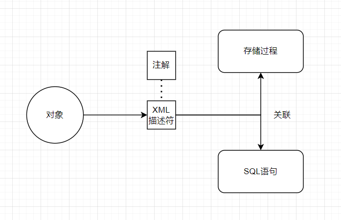
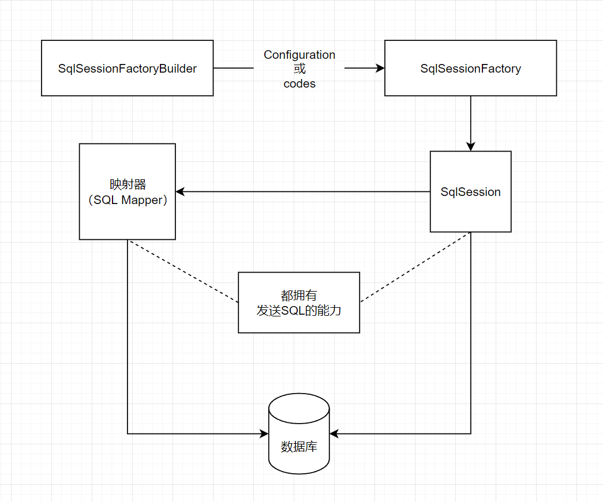
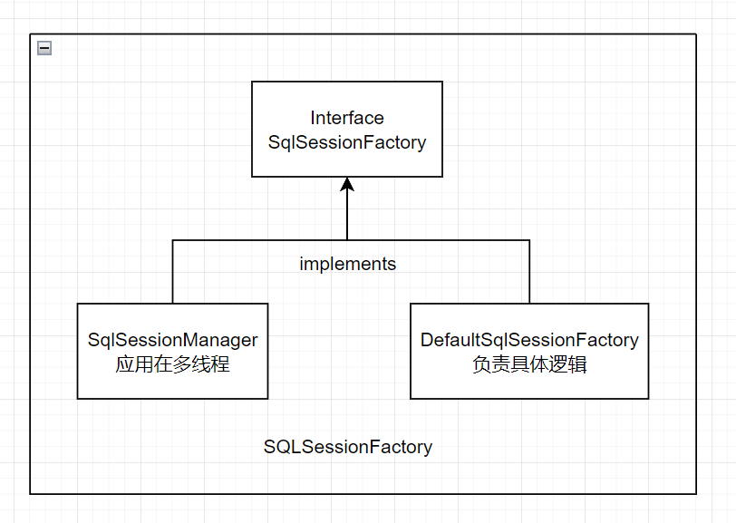
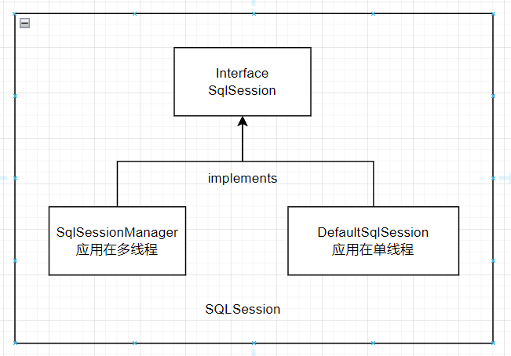
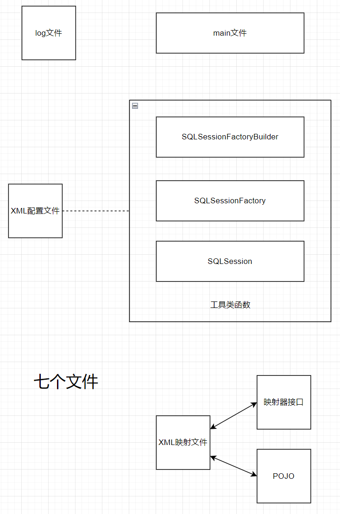

# MyBatis

---

## 简介

> 互联网持久框架（persistence framework）
>
> 持久化，即将数据持久保存，将数据存储到硬盘，即使断电、也依然存在。
>
> 持久化框架：就是协助并自动将程序数据存储到数据库中，作为介于应用程序与数据库之间的中间件，对任意一方所起到的作用都是去差异化，用以进行双方的交互。
>
> ORM（Object Relational Mapping）：对象关系映射
>
> 许多持久性框架也是对象关系映射工具，此类框架将应用程序域中的对象映射到需要在数据库中持久化的数据。可以使用XML文件或注释来定义映射。

MyBatis是一个Java持久化框架，它通过XML描述符或注解把对象与存储过程或SQL语句关联起来，映射成数据库内对应的记录。

特点：与其他对象关系映射框架不同，MyBatis没有将Java对象与数据库表关联起来，而是将Java方法与SQL语句关联。



**MyBatis所处的位置**


## 优点

- 不屏蔽SQL语句。
- 优秀的映射机制。
- 提供了Mapper接口编程，可以轻松创建映射器，更专注于业务逻辑。

## 四大核心组件



### SqlSessionFactoryBuilder

> 没错：它使用了建造者模式，构建SQLSessionFactory的构造器。

### SqlSessionFactory

> 没错：它使用了工厂模式，使用它来创建SQLSession。

### SqlSession

> 承载SQL信息，与数据库交互的关键。

### SQL Mapper

> 新组件，提高了代码的可读性和可维护性。

## Detail

### First

---

1. SqlSessionFactoryBuilder：SqlSessionFactory构造器


### Second

---

2. SqlSessionFactory：SQLSession工厂

   它的责任在整个MyBatis中是唯一的，其作用就是生成SQLSession（SQL会话）。

   每一个基于MyBatis的应用都是以SqlSessionFactory实例为中心的。



> MyBatis中的XML分为两类：基础配置文件与映射文件

XML配置文件简单示例

> transaction Manager：事务管理器
>
> data Source：数据源

```xml
<?xml version="1.0" encoding="UTF-8" ?>
<!DOCTYPE configuration
  PUBLIC "-//mybatis.org//DTD Config 3.0//EN"
  "http://mybatis.org/dtd/mybatis-3-config.dtd">
<configuration>
  <environments default="development">
    <environment id="development">
      <transactionManager type="JDBC"/>
      <dataSource type="POOLED">
        <property name="driver" value="${driver}"/>
        <property name="url" value="${url}"/>
        <property name="username" value="${username}"/>
        <property name="password" value="${password}"/>
      </dataSource>
    </environment>
  </environments>
  <mappers>
    <mapper resource="org/mybatis/example/BlogMapper.xml"/>
  </mappers>
</configuration>
```

从XML中构建SqlSessionFactory

```java
String resource = "org/mybatis/example/mybatis-config.xml";
InputStream inputStream = Resources.getResourceAsStream(resource);
SqlSessionFactory sqlSessionFactory = new SqlSessionFactoryBuilder().build(inputStream);
```

也可以从Java代码中构建SqlSessionFactory（不利于维护）

```java
DataSource dataSource = BlogDataSourceFactory.getBlogDataSource();
TransactionFactory transactionFactory = new JdbcTransactionFactory();
Environment environment = new Environment("development", transactionFactory, dataSource);
Configuration configuration = new Configuration(environment);
configuration.addMapper(BlogMapper.class);
SqlSessionFactory sqlSessionFactory = new SqlSessionFactoryBuilder().build(configuration);
```

### Third

---

3.SqlSession：Sql会话

> SqlSession提供了在数据库执行SQL命令所需的全部方法。



作用：

- 获取Mapper接口
- 发送SQL给数据库
- 控制数据库事务

### forth

---

4.映射器

映射器由一个接口和对应的XML文件（或注解）组成。

> - 描述 映射规则。
> - 提供SQL语句，并可以配置SQL参数类型、返回类型、缓存刷新等信息。
> - 配置缓存。
> - 提供动态SQL。

#### 执行SQL语句

通过 **SqlSession** 实例来直接执行已映射的 SQL 语句。（way1）

```java
try (SqlSession session = sqlSessionFactory.openSession()) {
  Blog blog = (Blog) session.selectOne("org.mybatis.example.BlogMapper.selectBlog", 101);
}
```

通过 **Mapper** 实例来直接执行已映射的 SQL 语句。（way2）

```java
try (SqlSession session = sqlSessionFactory.openSession()) {
  BlogMapper mapper = session.getMapper(BlogMapper.class);
  Blog blog = mapper.selectBlog(101);
}
```

这两种方式的区别在于：第二种方式使用了和指定语句的**参数**和**返回值**相匹配的接口。
这样做的好处在于：在保留原有接口的优点的前提下，将不用担心可能出错的字符串字面值以及强制类型转换。

接下来说说是如何映射的。

#### 映射SQL语句

一个语句既可以通过XML定义，也可以通过注解定义。

#### One

先看XML定义，以下是XML映射文件

```xml
<?xml version="1.0" encoding="UTF-8" ?>
<!DOCTYPE mapper
  PUBLIC "-//mybatis.org//DTD Mapper 3.0//EN"
  "http://mybatis.org/dtd/mybatis-3-mapper.dtd">
<mapper namespace="org.mybatis.example.BlogMapper">
  <select id="selectBlog" resultType="Blog">
    select * from Blog where id = #{id}
  </select>
</mapper>
```

> Description：
> 此文件中定义了一个名为“selectBlog”的映射语句，因为它所处的mapper的命名空间声明了一个全限定名，所以该映射语句可以通过全限定名“org.mybatis.example.BlogMapper.selectBlog”去使用，像“way1”中那样。
>
> ```java
> Blog blog = (Blog) session.selectOne("org.mybatis.example.BlogMapper.selectBlog", 101);
> ```
>
> 命名空间“namespace”的使用有利于我们更方便的使用MyBatis。（采用自官网的建议）
>
> 因为此文件定义了一个全限定名的SQL语句（selectBlog），该命名将被直接映射到“在命名空间中同名的”映射器类，这也使得我们可以通过映射器接口轻松的完成对它的调用，就像“way2”中那样。
>
> ```java
> BlogMapper mapper = session.getMapper(BlogMapper.class);
> Blog blog = mapper.selectBlog(101);
> ```
>
> 二者相比之下，way2的安全性会更好。

#### Two

现在看注解定义，以下是使用Java注解进行的定义

```java
package org.mybatis.example;
public interface BlogMapper {
  @Select("SELECT * FROM blog WHERE id = #{id}")
  Blog selectBlog(int id);
}
```

在这个示例中，注解和XML完成了相同的工作，显然注解在进行这种简单工作的时候更加简洁，但对于稍微复杂一点的语句，Java 注解不仅力不从心，还会让本就复杂的 SQL 语句更加混乱不堪。 因此，如果需要做一些很复杂的操作，最好用 XML 来映射语句。

### 作用域（Scope）

生命周期

> 即每个对象的存活时间，当一个对象的生命周期结束以后，就会被销毁以释放资源。

#### SqlSessionFactoryBuilder

方法作用域

> 一旦创建了 SqlSessionFactory，就不再需要它了

#### SqlSessionFactory

应用作用域

> 一旦被创建就应该在应用的运行期间一直存在，没有任何理由丢弃它或重新创建另一个实例。
> 这是因为其应该被认为是一个数据库连接池，过多的连接池不仅会造成冗余，甚至会导致资源用尽，导致系统宕机的严重后果。

#### SqlSession

请求或方法作用域

> 每个线程都应该有它自己的 SqlSession 实例。SqlSession 的实例不是线程安全的，因此是不能被共享的。
> SqlSession是数据交互的主要载体和执行方，也是占用资源的主要对象，必须要谨慎控制其生命周期，否则仍有宕机的风险。

#### 映射器实例

方法作用域

> 虽然从技术层面上来讲，任何映射器实例的最大作用域与请求它们的 SqlSession 相同。但方法作用域才是映射器实例的最合适的作用域。
> 映射器实例应该在调用它们的方法中被获取，使用完毕之后即可丢弃。

## Concise

> 此模块将简明的表述重点知识，亦或是对大段内容的梳理。



在second中有提到过，Mybatis有两类xml文件，
大体上来说，他们的任务都是完成映射，一个是Builder通过XML配置文件去完成数据库的映射；另一个是相关SQL语句，为映射器提供的映射文件。

Builder、Factory、Session同属工具类函数，将他们放在一块；映射器接口和POJO同属被映射的简单文件。

最后再加上main文件和logging文件。

整体即：2（XML映射文件）+ 3（1工具类 + 2简单文件——3被映射文件）+ 2（main文件和logging文件） = 7.