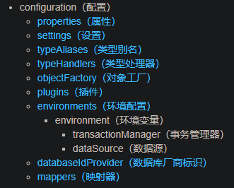
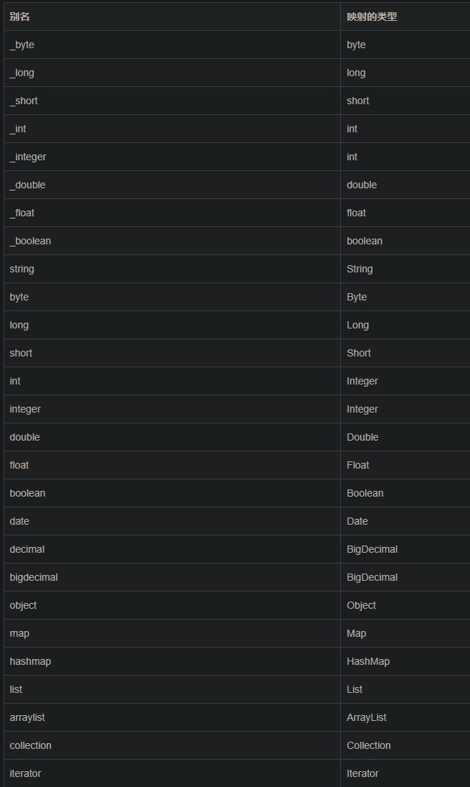
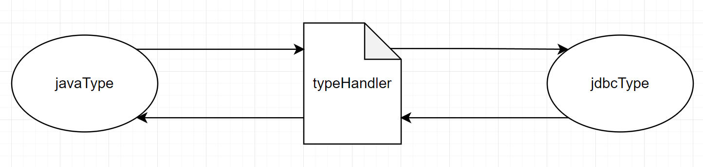

# MyBatis配置

---

MyBatis 的配置文件包含了会深深影响 MyBatis 行为的设置和属性信息。 配置文档的顶层结构如下：



# 连接池

---

连接池全称为数据库连接池，英文：connection pool，连接池是维护数据库连接的缓存，一边在将来需要对数据库发出请求时可以重用连接。

在数据连接的过程中，创建连接后，将连接放在池中并再次使用，以减少对连接的反复“创建-关闭”，大大降低了性能消耗。

---

## 属性（properties）

作用：给系统配置运行参数。

使用方式：property子元素、properties文件、程序代码传递
为了给配置提供灵活性，可以使用properties文件与程序代码传递的方式完成配置。


**子元素**

示例

设置好的属性

```xml
<properties>
    <property name="driver" value="com.mysql.jdbc.Driver"/>
  	<property name="url" value="jdbc:mysql://localhost:3306/myDB"/>
    <property name="username" value="root"/>
  	<property name="password" value="123456"/>
</properties>
```

需要动态配置的属性值“value="${……}"

```xml
<dataSource type="POOLED">
    <property name="driver" value="${driver}"/>
  	<property name="url" value="${url}"/>
  	<property name="username" value="${username}"/>
  	<property name="password" value="${password}"/>
</dataSource>
```

如示例所示，设置好的属性可以在整个配置文件中用来替换需要动态配置的属性值。


**properties 文件**

配置原理就是简单的“键值对应”，就是将原本在配置文件中设定的子元素抽离成一个properties文件的形式单独存在。

示例

创建一个jdbc.properties文件

```properties
driver=com.mysql.jdbc.Driver
url=jdbc:mysql://localhost:3306/myDB
username=root
password=123456
```

在MyBatis配置文件中引入properties文件

```xml
<properties resource="jdbc.properties"/>
```

**程序代码传递**

在build()方法中传入属性值。

```java
String resource = "mybatis-config.xml";
InputStream in = Resources.getResourceAsStream("jdbc.properties");
Properties props = new Properties;
props.load(in);
InputStream inputStream = Resources.getResourceAsStream(resource);
SqlsessionFactory factory = new SqlSessionFactoryBuilder().build(inputStream,props);		//mybatis配置文件与properties文件
```

**优先级**

程序代码传递 > properties 文件 > property子元素


---

## 设置（settings）

这是 MyBatis 中极为重要的调整设置，它们会改变 MyBatis 的运行时行为。相关的信息就是设置一下参数。

> 详细配置说明见[官方说明](https://mybatis.org/mybatis-3/zh/configuration.html#settings)。

```xml
<setting>
    <setting name="cacheEnabled" value="true"/>
    <setting name="lazyLoadingEnabled" value="true"/>
    <setting name="multipleResultSetsEnabled" value="true"/>
    <setting name="useColumnLabel" value="true"/>
    <setting name="useGeneratedKeys" value="false"/>
    <setting name="autoMappingBehavior" value="PARTIAL"/>
    <setting name="autoMappingUnknownColumnBehavior" value="WARNING"/>
    <setting name="defaultExecutorType" value="SIMPLE"/>
    <setting name="defaultStatementTimeout" value="25"/>
    <setting name="defaultFetchSize" value="100"/>
    <setting name="safeRowBoundsEnabled" value="false"/>
    <setting name="mapUnderscoreToCamelCase" value="false"/>
    <setting name="localCacheScope" value="SESSION"/>
    <setting name="jdbcTypeForNull" value="OTHER"/>
    <setting name="lazyLoadTriggerMethods" value="equals,clone,hashCode,toString"/>    
</setting>
```


---

## 类型别名（typeAliases）

类型别名可为 Java 类型设置一个缩写名字。 它仅用于 XML 配置，意在降低冗余的全限定类名书写。

```xml
<typeAliases>
    <typeAlias alias="role" type="org.example.pojo.Role"/>
</typeAliases>
```

如果需要类型别名的类过多，可以通过引用包名的方式完成，系统会自动给包中所含的类名进行转换，形式为首字母小写。

```xml
<typeAliases>
  <package name="domain.blog"/>
</typeAliases>
```

在对包进行自动命名的时候可能会遇到重复命名，这时可以使用注解的方式主动为类进行命名。

```java
@Alias("author")		//命名为author
public class Author {
    ...
}
```

mybatis-java内建别名




---

## 类型处理器（typeHandlers）



typeHandler分为javaType与jdbcType

> javaType是用于定义Java类型（应用程序中的数据为java类型）
>
> jdbcType是用于定义数据库类型（数据库中的数据为数据库类型）

 在设置预处理语句（PreparedStatement）中的参数或从结果集中取出一个值时， 都会用类型处理器将获取到的值以合适的方式转换成 Java 类型。

故也称类型转换器。

Mybatis系统中的预定义


可以重写已有的类型处理器或创建自己的类型处理器。

 具体做法为：实现 `org.apache.ibatis.type.TypeHandler` 接口，或继承一个很便利的类 `org.apache.ibatis.type.BaseTypeHandler`， 
						并且可以（可选地）将它映射到一个 JDBC 类型。

```java
public interface TypeHandler<T> {
    void setParameter(PreparedStatement var1, int var2, T var3, JdbcType var4) throws SQLException;

    T getResult(ResultSet var1, String var2) throws SQLException;

    T getResult(ResultSet var1, int var2) throws SQLException;

    T getResult(CallableStatement var1, int var2) throws SQLException;
}
```

```java
public abstract class BaseTypeHandler<T> extends TypeReference<T> implements TypeHandler<T> {
    public void setNonNullParameter(PreparedStatement preparedStatement, int i, Object o, JdbcType jdbcType) throws SQLException {}
    public Object getNullableResult(ResultSet resultSet, String s) throws SQLException {return null;}
    public Object getNullableResult(ResultSet resultSet, int i) throws SQLException {return null;}
    public Object getNullableResult(CallableStatement callableStatement, int i) throws SQLException {return null;}
```

示例：

```java
// ExampleTypeHandler.java
@MappedJdbcTypes(JdbcType.VARCHAR)
public class ExampleTypeHandler extends BaseTypeHandler<String> {

  @Override
  public void setNonNullParameter(PreparedStatement ps, int i, String parameter, JdbcType jdbcType) throws SQLException {
    ps.setString(i, parameter);
  }

  @Override
  public String getNullableResult(ResultSet rs, String columnName) throws SQLException {
    return rs.getString(columnName);
  }

  @Override
  public String getNullableResult(ResultSet rs, int columnIndex) throws SQLException {
    return rs.getString(columnIndex);
  }

  @Override
  public String getNullableResult(CallableStatement cs, int columnIndex) throws SQLException {
    return cs.getString(columnIndex);
  }
}
```

```xml
<!-- mybatis-config.xml -->
<typeHandlers>
  <typeHandler handler="org.mybatis.example.ExampleTypeHandler"/>
</typeHandlers>
```

在处理java类型时，默认是泛型，可以通过两种方式去指定强类型：

- 在类型处理器的配置元素（typeHandler 元素）上增加一个 `javaType` 属性（比如：`javaType="String"`）；
- 在类型处理器的类上增加一个 `@MappedTypes` 注解指定与其关联的 Java 类型列表。 如果在 `javaType` 属性中也同时指定，则注解上的配置将被忽略。

可以通过两种方式来指定关联的 JDBC 类型：

- 在类型处理器的配置元素上增加一个 `jdbcType` 属性（比如：`jdbcType="VARCHAR"`）；
- 在类型处理器的类上增加一个 `@MappedJdbcTypes` 注解指定与其关联的 JDBC 类型列表。 如果在 `jdbcType` 属性中也同时指定，则注解上的配置将被忽略。

若想映射枚举类型 `Enum`，则需要从 `EnumTypeHandler` 或者 `EnumOrdinalTypeHandler` 中选择一个来使用。


---

## 对象工厂（objectFactory）

每次 MyBatis 创建结果对象的新实例时，它都会使用一个对象工厂（ObjectFactory）实例来完成实例化工作。

如果想覆盖对象工厂的默认行为，可以通过创建自己的对象工厂来实现。

org.apache.ibatis.reflection.factory.DefaultObjectFactory

自定对象工厂示例：

```java
// ExampleObjectFactory.java
public class ExampleObjectFactory extends DefaultObjectFactory {
  @Override
  public <T> T create(Class<T> type) {
    return super.create(type);
  }

  @Override
  public <T> T create(Class<T> type, List<Class<?>> constructorArgTypes, List<Object> constructorArgs) {
    return super.create(type, constructorArgTypes, constructorArgs);
  }

  @Override
  public void setProperties(Properties properties) {
    super.setProperties(properties);
  }

  @Override
  public <T> boolean isCollection(Class<T> type) {
    return Collection.class.isAssignableFrom(type);
  }
}
```

```xml
<!-- mybatis-config.xml -->
<objectFactory type="org.mybatis.example.ExampleObjectFactory">
  <property name="property" value="value1"/>
</objectFactory>
```

ObjectFactory 接口很简单，它包含两个创建实例用的方法，一个是处理默认无参构造方法的，另外一个是处理带参数的构造方法的。 另外，setProperties 方法可以被用来配置 ObjectFactory，在初始化你的 ObjectFactory 实例后， objectFactory 元素体中定义的属性会被传递给 setProperties 方法。

org.apache.ibatis.reflection.factory.ObjectFactory

```java
public interface ObjectFactory {
    default void setProperties(Properties properties) {
    }

    <T> T create(Class<T> var1);

    <T> T create(Class<T> var1, List<Class<?>> var2, List<Object> var3);

    <T> boolean isCollection(Class<T> var1);
}
```


---

## 环境配置（environments）

Mybatis可以通过环境配置以适用于多种数据库，这种机制有助于将 SQL 映射应用于多种数据库之中。

但**每个数据库只能对应一个 SqlSessionFactory 实例**。如下 ↓

可以接受环境配置的两个方法签名是：

```java
SqlSessionFactory factory = new SqlSessionFactoryBuilder().build(reader, environment);
SqlSessionFactory factory = new SqlSessionFactoryBuilder().build(reader, environment, properties);
```

如果忽略了环境参数，那么将会加载默认环境，如下所示：

```java
SqlSessionFactory factory = new SqlSessionFactoryBuilder().build(reader);
SqlSessionFactory factory = new SqlSessionFactoryBuilder().build(reader, properties);
```

environments 元素定义了如何配置环境。

```xml
<environments default="development">
  <environment id="development">
    <transactionManager type="JDBC">
      <property name="..." value="..."/>
    </transactionManager>
    <dataSource type="POOLED">
      <property name="driver" value="${driver}"/>
      <property name="url" value="${url}"/>
      <property name="username" value="${username}"/>
      <property name="password" value="${password}"/>
    </dataSource>
  </environment>
</environments>
```

注意一些关键点:

- 默认使用的环境 ID（比如：default="development"）。
- 每个 environment 元素定义的环境 ID（比如：id="development"）。
- 事务管理器的配置（比如：type="JDBC"）。
- 数据源的配置（比如：type="POOLED"）。


### 事务管理器（transactionManager）

在 MyBatis 中有两种类型的事务管理器：**JDBC** 和 **MANAGED**

---

**jdbc**： 这个配置直接使用了 JDBC 的提交和回滚功能，它依赖从数据源获得的连接来管理事务作用域。

```xml
<transactionManager type="JDBC">
  <property name="skipSetAutoCommitOnClose" value="true"/>
</transactionManager>
```

对`skipSetAutoCommitOnClose`属性的说明：

> 默认情况下，为了与某些驱动程序兼容，它在关闭连接时启用自动提交。
> 然而，对于某些驱动程序来说，启用自动提交不仅是不必要的，而且是一个代价高昂的操作。

---

**managed**：这个配置几乎没做什么。它从不提交或回滚一个连接，而是让容器来管理事务的整个生命周期（比如 JEE 应用服务器的上下文）。

```xml
<transactionManager type="MANAGED">
  <property name="closeConnection" value="false"/>
</transactionManager>
```

对`closeConnection`属性的说明：

> 与JDBC类型相反，默认情况下，它会关闭连接。
> 然而一些容器并不希望连接被关闭，因此需要将 closeConnection 属性设置为 false 来阻止默认的关闭行为。

---

如果正在使用 Spring + MyBatis，则没有必要配置事务管理器，因为 Spring 模块会使用自带的管理器来覆盖前面的配置。

**另注：**

+ 使用TransactionFactory 接口和Transaction 接口，可以完全自定义 MyBatis 对事务的处理。

```java
public interface Transaction {
  Connection getConnection() throws SQLException;
  void commit() throws SQLException;
  void rollback() throws SQLException;
  void close() throws SQLException;
  Integer getTimeout() throws SQLException;
}
```

```java
public interface TransactionFactory {
  default void setProperties(Properties props) { // 从 3.5.2 开始，该方法为默认方法
    // 空实现
  }
  Transaction newTransaction(Connection conn);
  Transaction newTransaction(DataSource dataSource, TransactionIsolationLevel level, boolean autoCommit);
}
```


### 数据源（dataSource）

dataSource 元素使用标准的 JDBC 数据源接口来配置 JDBC 连接对象的资源。

---

**UNPOOLED**

顾名思义，这个数据源的实现会每次请求时打开和关闭连接，性能表现依赖于所使用的数据库。

此类型数据源仅仅需要配置以下 5 种属性：

- `driver` – 这是 JDBC 驱动的 Java 类全限定名（并不是 JDBC 驱动中可能包含的数据源类）。
- `url` – 这是数据库的 JDBC URL 地址。
- `username` – 登录数据库的用户名。
- `password` – 登录数据库的密码。
- `defaultTransactionIsolationLevel` – 默认的连接事务隔离级别。
- `defaultNetworkTimeout` – 等待数据库操作完成的默认网络超时时间（单位：毫秒）。

---

**POOLED**

这种数据源的实现利用“池”的概念，能使并发 Web 应用快速响应请求。

除了上述提到 UNPOOLED 下的属性外，还有更多属性用来配置 POOLED 的数据源：

1. **`poolMaximumActiveConnections`** 

> 在任意时间可存在的活动（正在使用）连接数量，默认值：10

2. **`poolMaximumIdleConnections`**

> 任意时间可能存在的空闲连接数。

3. **`poolMaximumCheckoutTime`**

> 在被强制返回之前，池中连接被检出（checked out）时间，默认值：20000 毫秒（即 20 秒）

4. **`poolTimeToWait`**

> 这是一个底层设置，如果获取连接花费了相当长的时间，连接池会打印状态日志并重新尝试获取一个连接（避免在误配置的情况下一直失败且不打印日志），默认值：20000 毫秒（即 20 秒）。

5. **`poolMaximumLocalBadConnectionTolerance`**

> 这是一个关于坏连接容忍度的底层设置， 作用于每一个尝试从缓存池获取连接的线程。 如果这个线程获取到的是一个坏的连接，那么这个数据源允许这个线程尝试重新获取一个新的连接，但是这个重新尝试的次数不应该超过 `poolMaximumIdleConnections` 与 `poolMaximumLocalBadConnectionTolerance` 之和。 默认值：3（新增于 3.4.5）

6. **`poolPingQuery`**

> 发送到数据库的侦测查询，用来检验连接是否正常工作并准备接受请求。默认是“NO PING QUERY SET”，这会导致多数数据库驱动出错时返回恰当的错误消息。

7. **`poolPingEnabled`**

> 是否启用侦测查询。若开启，需要设置 `poolPingQuery` 属性为一个可执行的 SQL 语句（最好是一个速度非常快的 SQL 语句），默认值：false。

8. **`poolPingConnectionsNotUsedFor`**

> 配置 poolPingQuery 的频率。可以被设置为和数据库连接超时时间一样，来避免不必要的侦测，默认值：0（即所有连接每一时刻都被侦测 — 当然仅当 poolPingEnabled 为 true 时适用）。

---

**JNDI**

这个数据源实现是为了能在如 EJB 或应用服务器这类容器中使用。日后再续……


---

## 数据库厂商标识（databaseIdProvider）

MyBatis 可以根据不同的数据库厂商执行不同的语句。

**系统预设**

在 mybatis-config.xml 文件中加入 `databaseIdProvider` 即可使用

> 属性value定义的是数据库厂商的别名

```xml
<databaseIdProvider type="DB_VENDOR">
  <property name="MySQL" value="mysql"/>
  <property name="DB2" value="db2"/>
  <property name="Oracle" value="oracle" />
</databaseIdProvider>
```

这种多厂商的支持是基于映射语句中的 `databaseId` 属性。

```xml
<select id="getRole" parameterType="long" resultType="role" databaseId="mysql">
        select id, role_name as roleName, note from t_role where id = #{id}
</select>
```

如果同时找到带有 `databaseId` 和不带 `databaseId` 的相同语句，则后者会被舍弃。

**自定规则**

通过实现MyBatis提供的接口 DatabaseIdProvider 完成自定规则。

```java
public interface DatabaseIdProvider {
  default void setProperties(Properties p) { // 从 3.5.2 开始，该方法为默认方法
    // 空实现
  }
  String getDatabaseId(DataSource dataSource) throws SQLException;
}
```

```java
public class MyDatabaseIdProvider implements DatabaseIdProvider {

    private static final String DATABASE_TYPE_DB2 = "DB2";
    private static final String DATABASE_TYPE_MySQL = "MySQL";
    private static final String DATABASE_TYPE_ORACLE = "Oracle";

    private Logger log = Logger.getLogger(MyDatabaseIdProvider.class);

    @Override
    public void setProperties(Properties p) {
        log.info(p);
    }

    @Override
    public String getDatabaseId(DataSource dataSource) throws SQLException {
        
        Connection connection = dataSource.getConnection();
        String dbProductName = connection.getMetaData().getDatabaseProductName();
        
        if (MyDatabaseIdProvider.DATABASE_TYPE_DB2.equals(dbProductName)) {
            return "db2";
        } else if (MyDatabaseIdProvider.DATABASE_TYPE_ORACLE.equals(dbProductName)) {
            return "oracle";
        } else if (MyDatabaseIdProvider.DATABASE_TYPE_MySQL.equals(dbProductName)) {
            return "MySQL";
        }else {
            return null;   
        }
    }
}
```


---

## 映射器（mappers）

> 既然 MyBatis 的行为已经由上述元素配置完了，我们现在就要来定义 SQL 映射语句了。
> 但首先，我们需要告诉 MyBatis 到哪里去找到这些语句。
> 在自动查找资源方面，Java 并没有提供一个很好的解决方案，所以最好的办法是直接告诉 MyBatis 到哪里去找映射文件。

可以使用相对于类路径的资源引用，或完全限定资源定位符（包括 `file:///` 形式的 URL），或类名和包名等。

下面是对相同文件的多种引用方式。

```xml
<!-- 使用相对于类路径的资源引用 -->
<mappers>
  <mapper resource="org/mybatis/builder/AuthorMapper.xml"/>
  <mapper resource="org/mybatis/builder/BlogMapper.xml"/>
  <mapper resource="org/mybatis/builder/PostMapper.xml"/>
</mappers>
```

```xml
<!-- 使用完全限定资源定位符（URL） -->
<mappers>
  <mapper url="file:///var/mappers/AuthorMapper.xml"/>
  <mapper url="file:///var/mappers/BlogMapper.xml"/>
  <mapper url="file:///var/mappers/PostMapper.xml"/>
</mappers>
```

```xml
<!-- 使用映射器接口实现类的完全限定类名 -->
<mappers>
  <mapper class="org.mybatis.builder.AuthorMapper"/>
  <mapper class="org.mybatis.builder.BlogMapper"/>
  <mapper class="org.mybatis.builder.PostMapper"/>
</mappers>
```

```xml
<!-- 将包内的映射器接口实现全部注册为映射器 -->
<mappers>
  <package name="org.mybatis.builder"/>
</mappers>
```

这些配置会告诉 MyBatis 去哪里找映射文件。