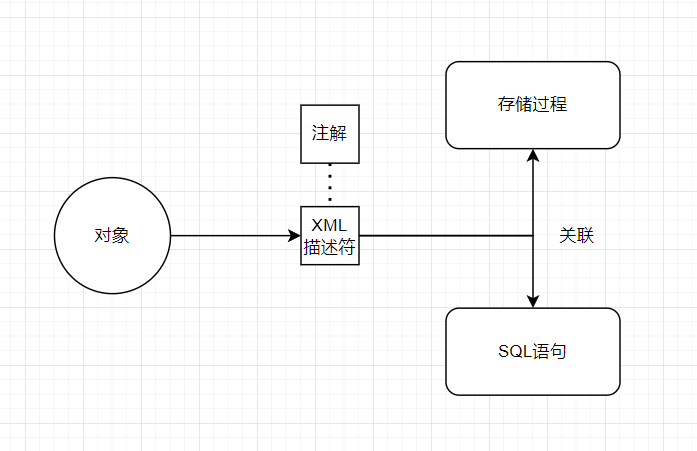
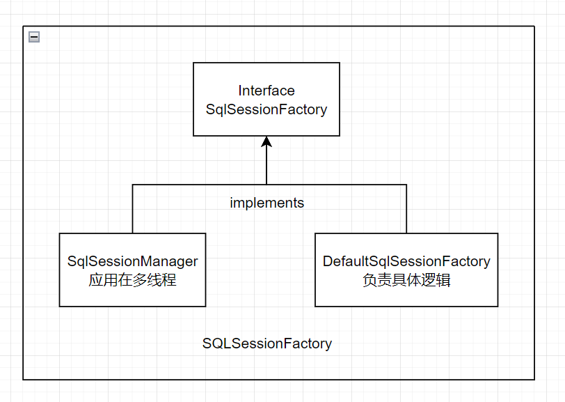
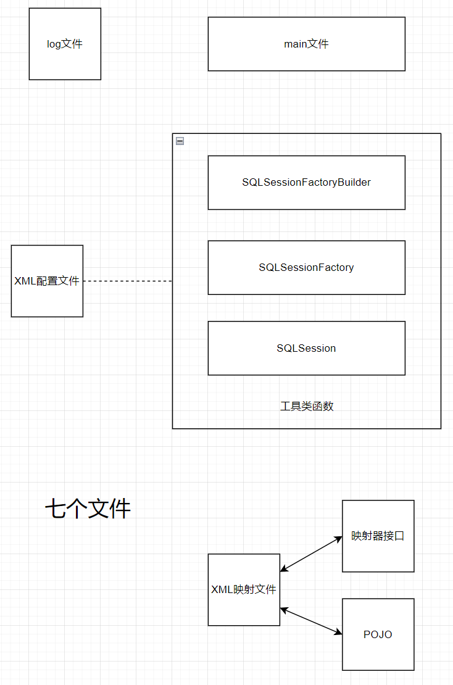

# MyBatis

---

## 简介

> 互联网持久框架（persistence framework）
>
> 持久化，即将数据持久保存，将数据存储到硬盘，即使断电、也依然存在。而持久化框架则是介于应用程序与数据库之间的中间件。

诚然，MyBatis是一个Java持久化框架，它通过XML描述符或注解把对象与存储过程或SQL语句关联起来，映射成数据库内对应的记录。

特点：与其他对象关系映射框架不同，MyBatis没有将Java对象与数据库表关联起来，而是将Java方法与SQL语句关联。



**MyBatis所处的位置**


## 优点

- 不屏蔽SQL语句。
- 优秀的映射机制。
- 提供了Mapper接口编程，可以轻松创建映射器，更专注于业务逻辑。

## 四大核心组件


### SqlSessionFactoryBuilder

> 没错：它使用了建造者模式，构建SQLSessionFactory的构造器。

### SqlSessionFactory

> 没错：它使用了工厂模式，使用它来创建SQLSession。

### SqlSession

> 承载SQL信息，与数据库交互的关键。

### SQL Mapper

> 新组件，提高了代码的可读性和可维护性。

## Detail

### First

---

1. SqlSessionFactoryBuilder：SqlSessionFactory构造器


### Second

---

2. SqlSessionFactory：SQLSession工厂

   它的责任在整个MyBatis中是唯一的，其作用就是生成SQLSession（SQL会话）。

   每一个基于MyBatis的应用都是以SqlSessionFactory实例为中心的。



> MyBatis中的XML分为两类：基础配置文件与映射文件

XML配置文件简单示例

> transaction Manager：事务管理器
>
> data Source：数据源

```xml
<?xml version="1.0" encoding="UTF-8" ?>
<!DOCTYPE configuration
  PUBLIC "-//mybatis.org//DTD Config 3.0//EN"
  "http://mybatis.org/dtd/mybatis-3-config.dtd">
<configuration>
  <environments default="development">
    <environment id="development">
      <transactionManager type="JDBC"/>
      <dataSource type="POOLED">
        <property name="driver" value="${driver}"/>
        <property name="url" value="${url}"/>
        <property name="username" value="${username}"/>
        <property name="password" value="${password}"/>
      </dataSource>
    </environment>
  </environments>
  <mappers>
    <mapper resource="org/mybatis/example/BlogMapper.xml"/>
  </mappers>
</configuration>
```

从XML中构建SqlSessionFactory

```java
String resource = "org/mybatis/example/mybatis-config.xml";
InputStream inputStream = Resources.getResourceAsStream(resource);
SqlSessionFactory sqlSessionFactory = new SqlSessionFactoryBuilder().build(inputStream);
```

也可以从Java代码中构建SqlSessionFactory（不利于维护）

```java
DataSource dataSource = BlogDataSourceFactory.getBlogDataSource();
TransactionFactory transactionFactory = new JdbcTransactionFactory();
Environment environment = new Environment("development", transactionFactory, dataSource);
Configuration configuration = new Configuration(environment);
configuration.addMapper(BlogMapper.class);
SqlSessionFactory sqlSessionFactory = new SqlSessionFactoryBuilder().build(configuration);
```

### Third

---

3.SqlSession：Sql会话

> SqlSession提供了在数据库执行SQL命令所需的全部方法。


作用：

- 获取Mapper接口
- 发送SQL给数据库
- 控制数据库事务

### forth

---

4.映射器

映射器由一个接口和对应的XML文件（或注解）组成。

> - 描述 映射规则。
> - 提供SQL语句，并可以配置SQL参数类型、返回类型、缓存刷新等信息。
> - 配置缓存。
> - 提供动态SQL。

#### 执行SQL语句

通过 **SqlSession** 实例来直接执行已映射的 SQL 语句。（way1）

```java
try (SqlSession session = sqlSessionFactory.openSession()) {
  Blog blog = (Blog) session.selectOne("org.mybatis.example.BlogMapper.selectBlog", 101);
}
```

通过 **Mapper** 实例来直接执行已映射的 SQL 语句。（way2）

```java
try (SqlSession session = sqlSessionFactory.openSession()) {
  BlogMapper mapper = session.getMapper(BlogMapper.class);
  Blog blog = mapper.selectBlog(101);
}
```

这两种方式的区别在于：第二种方式使用了和指定语句的**参数**和**返回值**相匹配的接口。
这样做的好处在于：在保留原有接口的优点的前提下，将不用担心可能出错的字符串字面值以及强制类型转换。

接下来说说是如何映射的。

#### 映射SQL语句

一个语句既可以通过XML定义，也可以通过注解定义。

#### One

先看XML定义，以下是XML映射文件

```xml
<?xml version="1.0" encoding="UTF-8" ?>
<!DOCTYPE mapper
  PUBLIC "-//mybatis.org//DTD Mapper 3.0//EN"
  "http://mybatis.org/dtd/mybatis-3-mapper.dtd">
<mapper namespace="org.mybatis.example.BlogMapper">
  <select id="selectBlog" resultType="Blog">
    select * from Blog where id = #{id}
  </select>
</mapper>
```

> Description：
> 此文件中定义了一个名为“selectBlog”的映射语句，因为它所处的mapper的命名空间声明了一个全限定名，所以该映射语句可以通过全限定名“org.mybatis.example.BlogMapper.selectBlog”去使用，像“way1”中那样。
>
> ```java
> Blog blog = (Blog) session.selectOne("org.mybatis.example.BlogMapper.selectBlog", 101);
> ```
>
> 命名空间“namespace”的使用有利于我们更方便的使用MyBatis。（采用自官网的建议）
>
> 因为此文件定义了一个全限定名的SQL语句（selectBlog），该命名将被直接映射到“在命名空间中同名的”映射器类，这也使得我们可以通过映射器接口轻松的完成对它的调用，就像“way2”中那样。
>
> ```java
> BlogMapper mapper = session.getMapper(BlogMapper.class);
> Blog blog = mapper.selectBlog(101);
> ```
>
> 二者相比之下，way2的安全性会更好。

#### Two

现在看注解定义，以下是使用Java注解进行的定义

```java
package org.mybatis.example;
public interface BlogMapper {
  @Select("SELECT * FROM blog WHERE id = #{id}")
  Blog selectBlog(int id);
}
```

在这个示例中，注解和XML完成了相同的工作，显然注解在进行这种简单工作的时候更加简洁，但对于稍微复杂一点的语句，Java 注解不仅力不从心，还会让本就复杂的 SQL 语句更加混乱不堪。 因此，如果需要做一些很复杂的操作，最好用 XML 来映射语句。

### 作用域（Scope）

生命周期

> 即每个对象的存活时间，当一个对象的生命周期结束以后，就会被销毁以释放资源。

#### SqlSessionFactoryBuilder

方法作用域

> 一旦创建了 SqlSessionFactory，就不再需要它了

#### SqlSessionFactory

应用作用域

> 一旦被创建就应该在应用的运行期间一直存在，没有任何理由丢弃它或重新创建另一个实例。
> 这是因为其应该被认为是一个数据库连接池，过多的连接池不仅会造成冗余，甚至会导致资源用尽，导致系统宕机的严重后果。

#### SqlSession

请求或方法作用域

> 每个线程都应该有它自己的 SqlSession 实例。SqlSession 的实例不是线程安全的，因此是不能被共享的。
> SqlSession是数据交互的主要载体和执行方，也是占用资源的主要对象，必须要谨慎控制其生命周期，否则仍有宕机的风险。

#### 映射器实例

方法作用域

> 虽然从技术层面上来讲，任何映射器实例的最大作用域与请求它们的 SqlSession 相同。但方法作用域才是映射器实例的最合适的作用域。
> 映射器实例应该在调用它们的方法中被获取，使用完毕之后即可丢弃。

## Concise

> 此模块将简明的表述重点知识，亦或是对大段内容的梳理。



在second中有提到过，Mybatis有两类xml文件，
大体上来说，他们的任务都是完成映射，一个是Builder通过XML配置文件去完成数据库的映射；另一个是相关SQL语句，为映射器提供的映射文件。

Builder、Factory、Session同属工具类函数，将他们放在一块；映射器接口和POJO同属被映射的简单文件。

最后再加上main文件和logging文件。

整体即：2（XML映射文件）+ 3（1工具类 + 2简单文件——3被映射文件）+ 2（main文件和logging文件） = 7.