# 前言

# 关系型数据库

即创建在关系模型基础上的数据库。（Relational Database）

## 数据库

保存有组织数据的容器。（database）

- 数据库中存放着一张或多张表。
- 表又由列和行组成。
- 每一列有着相同的数据类型。
- 为了方便查找，每一行都对应一个主键。

### 表

某种特定类型数据的结构化清单。

### 列

`column`：表中的一个字段。

### 行

`row`：表中的一个记录。

### 主键

`primary key`：一列（或一组列），其值能够唯一区分表中的每一行。

### 外键

`foreign key`：它包含另一个表的主键值，定义了两个表之间的关系。

### SQL

结构化查询语言（Structured Query Language）的缩写。

### DBMS

数据库管理系统。

### PRI

`primary key`：主键

### UNI

`unique key`：唯一键

### MUL

> 尽管主键具有唯一性，但主键不一定只有一列组成，假如主键由`order_num`和`order_item`两列组成，单出示一列，就可以说这是其所在表的索引，不必全部出示，这种特性被称作前导列特性。

- `multiple-key`：此键可不可笼统的理解为多键。此键的意思为：非唯一索引的前导列。
- `MUL`正是关系型数据库的产物，它是与此表有关系的另一数据表的主键（留在此表中的索引）。
- **非唯一索引**：此列的数据作为索引且此数据不具有唯一性。
- **前导列**：前导列特性，即触类旁通的特性。


---

# 引言

现在我们正式进入MySQL的学习，先了解一些基本语句：

```mysql
SHOW DATABASES;
-- 返回可用数据库的一个列表。
CREATE DATABASE crashcourse;
-- 创建一个名为‘crashcourse’的数据库
USE crashcourse;
-- 使用这个数据库
SHOW TABLES;
-- 返回此数据库内可用表的列表
SHOW COLUMNS FROM customers;
-- 返回‘customers’表中所有列名的列表
```


## 完全限定名

```mysql
SELECT products.prod_name FROM crashcourse.products;
-- 完全限定名检索
```


```mysql
SELECT prod_name FROM products;
-- 常规检索
```


# 数据检索

## 基础检索

一个简单的检索语句：

```MySQL
SELECT prod_name FROM products;
-- 检索单个列
```


```mysql
SELECT prod_id,vend_id,prod_name FROM products;
-- 检索多个列
```


```mysql
SELECT * FROM products;
-- 检索所有列
```


## 鲜明检索

```mysql
SELECT vend_id FROM products;
-- 常规检索
```


检索时，在某些情况下得到的原始数据会有重复的情况，下面的语句可以让每个数据仅出现一次，使检索到的数据都是不同的。

```mysql
SELECT DISTINCT vend_id FROM products;
-- 鲜明检索
```


## 限制检索

```mysql
SELECT prod_name FROM products;
-- 常规检索
```


```mysql
SELECT prod_name FROM products LIMIT 5;
-- 使返回的检索数据不得超过5行。
```


```mysql
SELECT prod_name FROM products LIMIT 5,5;
-- 从行5开始检索，检索的数据不得超过5行。
-- 检索的数据第一行不是行1，而是行0。
```


```mysql
SELECT prod_name FROM products LIMIT 2,3;
-- 从行2开始检索，检索的数据不得超过3行。
```


由于类似`LIMIT 2,3`这样的写法容易产生歧义导致混乱，所以在MySQL_5版本中，可以更规范的书写相同语义的句子。

```mysql
SELECT prod_name FROM products LIMIT 3 OFFSET 2;
```


# 排序检索

## 按单列

```mysql
SELECT prod_name FROM products ORDER BY prod_name;
-- 取prod_name列的名字据此进行排序
```


```mysql
SELECT prod_name FROM products ORDER BY prod_price;
-- 取其他列的名字据此进行排序也是合法的，但顺序就不尽如人意了
```


## 按多列

```mysql
SELECT prod_id,prod_price,prod_name FROM products ORDER BY prod_price,prod_name;
-- 此种排序方式类似于对姓名进行排序，即先按姓氏、再按照名字。
```


## 指定方向

```mysql
SELECT prod_id,prod_price,prod_name FROM products ORDER BY prod_price DESC;
-- DESC关键字为倒序，ASC为正序，默认为ASC
-- 当按多列进行倒序排序时如下
SELECT prod_id,prod_price,prod_name FROM products ORDER BY prod_price DESC,prod_name DESC;
```


# 过滤检索

```mysql
SELECT prod_name,prod_price 
FROM products 
WHERE prod_price = 2.50;
-- 检索两列，仅返回满足过滤条件的数据“ prod_price = 2.50 ”。
```


```mysql
SELECT prod_name,prod_price 
FROM products 
WHERE prod_name = 'carrots';
-- 不区分大小写
```


## BETWEEN操作符

```mysql
SELECT prod_name,prod_price 
FROM products 
WHERE prod_price BETWEEN 2.50 AND 10.00 
ORDER BY prod_price;
-- 介于价格在2.50到10.00之间的数据
-- between后接着起始值，and后接着结束值
```


## 空值检查

```mysql
SELECT * FROM vendors;
```


```mysql
SELECT vend_name,vend_state 
FROM vendors 
WHERE vend_state IS NULL;
-- 条件：vend_state值为空
```


## AND操作符

```mysql
SELECT vend_id,prod_name,prod_price 
FROM products 
WHERE vend_id = 1003 AND prod_price <= 10;
-- 过滤条件：vend_id = 1003 且 prod_price <= 10。
```


## OR操作符

```mysql
SELECT vend_id,prod_name,prod_price 
FROM products 
WHERE vend_id = 1002 OR vend_id = 1003;
-- 过滤条件：vend_id = 1002 或 vend_id = 1003。
```


## 计算次序

```mysql
SELECT vend_id,prod_name,prod_price 
FROM products 
WHERE (vend_id = 1002 OR vend_id = 1003) AND prod_price >= 10;
```


## IN操作符

```mysql
SELECT prod_name,prod_price 
FROM products 
WHERE vend_id IN (1002,1003) 
ORDER BY prod_price;
-- 免得使用过多的OR操作符引起不必要的混乱
```


## NOT 操作符

```mysql
SELECT prod_name,prod_price
FROM products
WHERE vend_id NOT IN (1002,1003)
ORDER BY prod_price;
-- 起否定意义
```


## like通配符

predicate：谓词，like其实起到的只是类似操作符的作用，like本身是predicate，通配符是下面要说的这些。

```mysql
SELECT prod_name,prod_id,prod_price
FROM products
WHERE prod_name LIKE 'jet%';
-- % 表示任意字符出现任意次数。
```


```mysql
SELECT prod_name,prod_id,prod_price
FROM products
WHERE prod_name LIKE '%anvil%';
```


```mysql
SELECT prod_name,prod_id,prod_price
FROM products
WHERE prod_name LIKE '_ ton anvil';
-- _ 通配符表示单个字符。
```


# 子查询

```mysql
SELECT cust_name,cust_contact
FROM customers
WHERE cust_id IN(SELECT cust_id
                FROM orders
                WHERE order_num IN(SELECT order_num
                                  FROM orderitems
                                  WHERE prod_id = 'TNT2'));
-- 子查询很简单，
-- 之前的查询语句都是单独的SQL语句，而子查询就是使用另一个语句所查询的数据，使用起来就是将那条语句放在对应的位置。
```


## 相关子查询

涉及外部查询的子查询。

```mysql
SELECT cust_name,
       cust_state,
       (SELECT COUNT(*)
        FROM orders
        WHERE orders.cust_id = customers.cust_id) AS orders
FROM customers
ORDER BY cust_name;
-- 需要注意的是，完成相关子查询时，要书写全限定名。
-- 如果不使用全限定名那么它将不会涉及外部查询，无法得到我们希望的数据。
```


# 组合查询

## UNION

将两条查询语句组合成一条查询语句。示例如下：

```mysql
SELECT vend_id, prod_id, prod_price
FROM products
WHERE prod_price <= 5;
```


```mysql
SELECT vend_id, prod_id, prod_price
FROM products
WHERE vend_id IN (1001,1002);
```


现在将这两条语句进行组合，很简单，就是用一个并（`UNION`）来衔接这两条语句：

```mysql
SELECT vend_id, prod_id, prod_price
FROM products
WHERE prod_price <= 5
UNION
SELECT vend_id, prod_id, prod_price
FROM products
WHERE vend_id IN (1001,1002);
```


- 要注意的是：
- `UNION`中的每个查询必须包含相同的列、表达式或聚集函数。实际上组合查询也可以应用不同表的查询数据。
- 列数据类型必须兼容（兼容即可，不必须相同。）
- 如果两次查询的列数不同，SQL会报错，但如果两次查询的列不同但列数相同，SQL仍然会执行！使用的列名是最先执行的查询语句所返回的列名，后面的查询数据会后继在此列后，所以一定要注意上述的条例！

---

观察组合前后的查询结果，不难发现在组合查询时，查询结果从9行变成了8行，这是因为组合查询返回结果时，默认是去除重复行的，那如何显示所有的行（包括重复行）？

使用`UNION ALL`即可，如下：

```mysql
SELECT vend_id, prod_id, prod_price
FROM products
WHERE prod_price <= 5
UNION ALL
SELECT vend_id, prod_id, prod_price
FROM products
WHERE vend_id IN (1001,1002);
```


## 对组合查询结果进行排序

```mysql
SELECT vend_id, prod_id, prod_price
FROM products
WHERE prod_price <= 5
UNION ALL
SELECT vend_id, prod_id, prod_price
FROM products
WHERE vend_id IN (1001,1002)
ORDER BY vend_id, prod_price;
```


---

> 本文档归属于`select`文档，因正则表达式的特殊性，所以将其作为分文档进行了解。
>
> 正则表达式本身是一个非常庞大的知识概念，MySQL中的正则表达式仅仅是其的一个子集。

# 正则表达式

​	正则表达式是用来匹配文本的特殊字符集合。


## 字符类

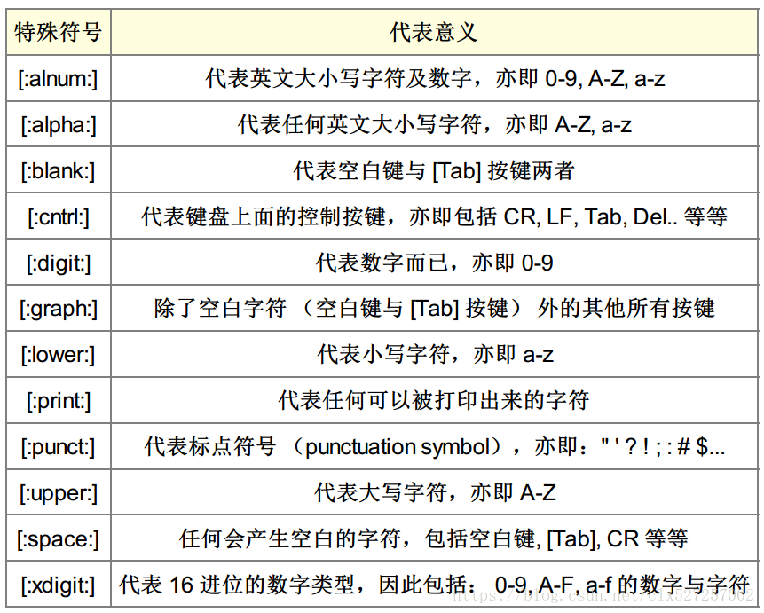


## 重复元字符

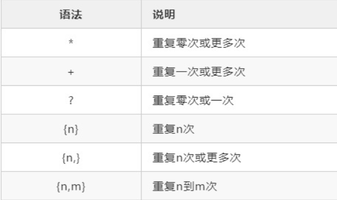


## 定位元字符

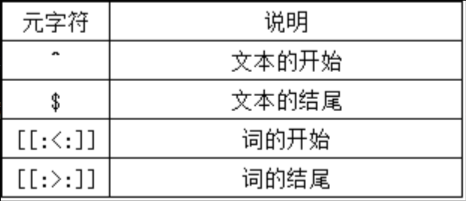


## REGEXP关键字

```mysql
SELECT prod_name
FROM products
WHERE prod_name REGEXP '1000'
ORDER BY prod_name;
-- REGEXP就像like，只不过like是MySQL的自定语义，而REGEXP则表示正则表达式的引用。
-- 很明显，'1000'就是一个正则表达式。
```


下面是一个较为正式的正则表达式的例子：

```mysql
SELECT prod_name
FROM products
WHERE prod_name REGEXP '.000'
ORDER BY prod_name;
```


```mysql
SELECT prod_name
FROM products
WHERE prod_name REGEXP '1000|2000'
ORDER BY prod_name;
-- "|"类似MySQL中的OR操作符。
```


```mysql
SELECT prod_name
FROM products
WHERE prod_name REGEXP '[123] Ton'
ORDER BY prod_name;
-- '[123] Ton'是'[1|2|3] Ton'的缩写，类似IN操作符。
```


```mysql
SELECT prod_name
FROM products
WHERE prod_name REGEXP '[^123] Ton'
ORDER BY prod_name;
-- 排除型字符集合
```


```mysql
SELECT prod_name
FROM products
WHERE prod_name REGEXP '[1-5] Ton'
ORDER BY prod_name;
-- 1到5
```


```mysql
SELECT vend_name
FROM vendors
WHERE vend_name REGEXP '\\.'
ORDER BY vend_name;
-- 由于正则表达式所用到的字符和所检索的数据发生了冲突，所以使用"\\"来消除歧义（转义）。类似的还可以'\\-'，表示匹配“-”。
-- 如果要匹配反斜杠本身\，则使用“\\\”。
```


```mysql
SELECT prod_name 
FROM products 
WHERE prod_name REGEXP '\\([0-9] sticks?\\)' 
ORDER BY prod_name;
-- "?"代表0或1个字符。
-- 反斜杠的转义效果只有一次！
-- 这意味着在正则表达式中，每当想表达普通字符时，都要使用反斜杠，所以REGEXP后出现了两次反斜杠，他们的作用都是对括号进行转义。
```

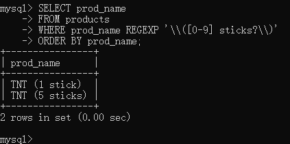


```mysql
SELECT prod_name
FROM products
WHERE prod_name REGEXP '[[:digit:]]{4}'
ORDER BY prod_name;
-- '[[:digit:]]{4}'的另一种写法是'[0-9][0-9][0-9][0-9]'
```

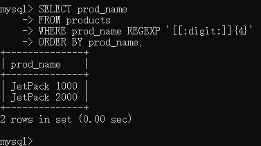


```mysql
SELECT prod_name
FROM products
WHERE prod_name REGEXP '^[0-9\\.]'
ORDER BY prod_name;
-- "^"匹配字符串的开始，也就是说[0123456789.]其中任意一个必须为字符串的开头第一个字符。
```

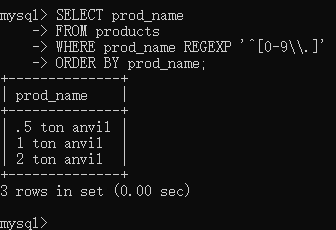


```mysql
SELECT prod_name
FROM products
WHERE prod_name REGEXP '[0-9\\.]'
ORDER BY prod_name;
-- "^" 有两种含义："否定集合[]。" 或是 "文本的开始。"
```


# END

正则表达式不依赖数据库中的表，REGEXP检查的结果只有两个：

>0：没有匹配
>
>1：匹配

所以可以这样来进行测试：

```mysql
SELECT 'hello' REGEXP '[0-9]';
-- hello字符串中当然没有数字，显然返回的是0.
```

---

# 计算字段

数据库中的数据在面对实际需求时，往往显得过于原始，通常需要对数据进行再次加工而满足客户端的需要，但这种操作不可能在检索数据结束 以后拿到客户机进行，我们需要直接检索出我们想要的数据，这就是计算字段诞生的理由了。

计算字段做什么？比方说，将企业的名字和企业的地址这两列数据在检索时拼接成一列数据。


## 拼接字段

```mysql
SELECT Concat(vend_name,' (',vend_country,')')
FROM vendors
ORDER BY vend_name;
-- Concat()函数的作用相当于Java语言中的"+".
```


## `Trim`函数

- `RTrim()`去除数据右侧多余空格
- `LTrim()`去除数据左侧多余空格
- `Trim()`去除数据两侧的多余空格

```mysql
SELECT Concat(RTrim(vend_name),' (',RTrim(vend_country),')')
FROM vendors
ORDER BY vend_name;
```


## 别名

```mysql
SELECT Concat(RTrim(vend_name),' (',RTrim(vend_country),')') AS vend_title
FROM vendors
ORDER BY vend_name;
-- 使用AS关键字进行别名的命名。
-- 别名有时也被称作"导出列"。
```


## 算数字段

```mysql
SELECT prod_id,
quantity,
item_price,
quantity*item_price AS expanded_price
FROM orderitems
WHERE order_num = 20005;
-- 计算总价格
```


## 其他

还有一些有趣的计算字段和技巧

```mysql
SELECT 8*8;
```

```mysql
SELECT Concat('this is ',Trim('  adc   '),'.');
```

```mysql
SELECT Now();
-- 返回"现在"的时间。
```

# 数据处理函数

上述的计算字段，实际上就是数据处理函数的使用，接下来介绍更多常用的数据处理函数。

```mysql
SELECT vend_name,Upper(vend_name) AS vend_name_upcase
FROM vendors
ORDER BY vend_name;
-- Upper()函数可将文本全部转换为大写。
```


## 常用的文本处理函数


> 有关`Soundex()`，SOUNDEX是一个将任何文本串转换为描述其语音表示的字母数字模式的算法。

话不多说，实例展示

```mysql
SELECT cust_name,cust_contact
FROM customers;
-- 先进行一下正常的基础检索
```


```mysql
SELECT cust_name,cust_contact
FROM customers
WHERE cust_contact = 'Y Lie';
-- 'Y Lie'和'Y Lee'的写法不同，但读音相同，这样查找显然将得到一个空集。
```


```mysql
SELECT cust_name,cust_contact
FROM customers
WHERE Soundex(cust_contact) = Soundex('Y Lie');
-- 这就是Soundex()函数的作用
-- SOUNDEX是一个将任何文本串转换为描述其语音表示的字母数字模式的算法。
```


## 常用日期和时间处理函数


> 无论什么时候指定一个日期，其格式都必须是：`yyyy-mm-dd`。


### 基础

```mysql
SELECT * FROM orders;
```


```mysql
SELECT cust_id, order_num
FROM orders
WHERE order_date = '2005-09-01';
-- yyyy-mm-dd
```


### 进阶1

接下来进行更细致的检索，在检索前先插入一条新的数据：

```mysql
INSERT INTO orders(order_num, order_date, cust_id)
VALUES(20010, '2022-8-28 20:17:19', 10001);
```

```mysql
SELECT * FROM orders;
```


```mysql
SELECT cust_id, order_num
FROM orders
WHERE order_date = '2022-8-28';
-- 这将得到一个空集，即使日期在数据中能够匹配，但显然时间不对。
```


```mysql
SELECT cust_id, order_num
FROM orders
WHERE Date(order_date) = '2022-8-28';
-- 返回日期时间的日期部分。
-- 在实际应用中，显然应该使用这种方法进行日期时间数据的检索方式（即使用Date()函数）。
```


### 进阶2

```mysql
SELECT cust_id, order_num
FROM orders
WHERE Date(order_date) BETWEEN '2005-09-01' AND '2005-09-30';
-- 检索某一时间段
```


### 进阶3

```mysql
SELECT cust_id,order_num
FROM orders
WHERE Year(order_date) = 2005 AND Month(order_date) = 9;
-- 进行2005年9月的数据过滤。
```


## 常用数值处理函数


---

# 聚集函数

聚集函数的主要作用就是对数据进行汇总，在进行数据汇总工作时，聚集函数在提高性能方面有很好的效果。

## `AVG()`函数

```mysql
SELECT AVG(prod_price) AS avg_price
FROM products;
-- 返回特定列的平均值。
```

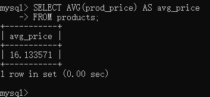


```mysql
SELECT AVG(prod_price) AS avg_price
FROM products
WHERE vend_id = 1003;
-- AVG()只能选择一列，这意味AVG()和列的关系是一对一的。
-- 忽略NULL.
```


## `COUNT()`函数

```mysql
SELECT COUNT(*) AS num_cust
FROM customers;
-- COUNT()函数的作用是计数（统计），例如对整个表中行数目进行统计。
```


```mysql
SELECT * FROM customers;
```


```mysql
SELECT COUNT(cust_email) AS num_cust
FROM customers;
-- 统计特定列时，对于null行将不会进行计数。
-- 而统计整个表时（*），是对所有行进行的计数。
```


## `MAX()`函数

```mysql
SELECT MAX(prod_price) AS max_price
FROM products;
-- 返回指定列中的最大值。要求指定列名。
-- 对于文本，将返回最后面的行。
-- 忽略NULL.
```


## `MIN()`函数

```mysql
SELECT MIN(prod_price) AS min_price
FROM products;
-- 返回指定列中的最小值。要求指定列名。
-- 对于文本，将返回最前面的行。
-- 忽略NULL.
```

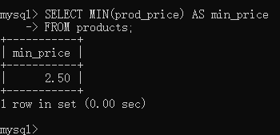


## `SUM()`函数

```mysql
SELECT SUM(quantity) AS items_ordered
FROM orderitems
WHERE order_num = 20005;
-- 特定列值的和（总计）。
-- 忽略NULL.
```


```mysql
SELECT SUM(item_price*quantity) AS total_price
FROM orderitems
WHERE order_num = 20005;
-- 合计计算（将两列数据进行计算后再求和）
```


## 聚集中的DISTINCT

```mysql
SELECT AVG(DISTINCT prod_price) AS avg_price
FROM products
WHERE vend_id = 1003;
-- 这样将只会选取不同的价格进行求平均值计算，相同的数值将不会被采纳。
```


## 组合

```mysql
SELECT COUNT(*) AS num_items,
MIN(prod_price) AS price_min,
MAX(prod_price) AS price_max,
AVG(prod_price) AS price_avg
FROM products;
```


# 分组数据

## GROUP BY

```mysql
SELECT vend_id,COUNT(*) AS num_prods
FROM products
GROUP BY vend_id;
-- 分组后，COUNT()会对分组的数据进行分组统计。
```


```mysql
SELECT vend_id,COUNT(*) AS num_prods
FROM products
GROUP BY vend_id WITH ROLLUP;
-- 分组的汇总，由于并未对分组的汇总指定vend_id，所以为null。
-- 计算字段（数据处理函数）的工作属于是对检索数据的再整理，并不影响元数据，所以即便是主键也可以使用WITH ROLLUP进行分组汇总。
```


## HAVING

HAVING的工作是过滤分组，之前学过的WHERE是过滤数据，但因为WHERE不能过滤分组，所以使用了HAVING。但现在情况反了过来，HAVING不仅支持过滤分组，也同样拥有WHERE所具有的一切功能。

```mysql
SELECT * FROM products WHERE vend_id = 1003;
```


```mysql
SELECT * FROM products HAVING vend_id = 1003;
```


显然，WHERE能做的，HAVING也能做。不同的是WHERE过滤的是分组前的数据，而HAVING过滤的是分组后的数据。

```mysql
SELECT cust_id,COUNT(*) AS orders
FROM orders
GROUP BY cust_id
HAVING COUNT(*) >= 2;
-- 包含过滤条件：组数 >= 2
```


当然，WHERE和HAVING可以组合使用，但由于二者的特性，规定，HAVING必须放在WHERE后使用，否则会报错。

```mysql
SELECT * FROM products WHERE vend_id = 1003 HAVING prod_id = 'FB';
```


下面的写法更加标准。

```mysql
SELECT vend_id,COUNT(*) AS num_prods
FROM products
WHERE prod_price >=10
GROUP BY vend_id
HAVING COUNT(*) >=2;
```


```mysql
SELECT vend_id,COUNT(*) AS num_prods
FROM products
GROUP BY vend_id
HAVING COUNT(*) >=2;
-- 这是去掉where部分的语句。
```

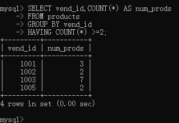


## 结合ORDER BY

```mysql
SELECT order_num,SUM(quantity*item_price) AS ordertotal
FROM orderitems
GROUP BY order_num
HAVING SUM(quantity*item_price) >= 50
ORDER BY ordertotal;
```

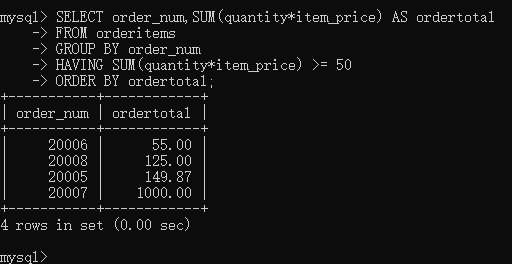

---

# 联结

联结是一种机制，用来在一条`SELECT`语句中关联表，因此称之为联结。

由于数据冗余会降低数据库的性能，所以良好的数据库都会尽量避免数据冗余来换取更好可伸缩性。作为存储方来说，这样的数据库是优秀的，但作为提取方，在数据检索时，这种设计思想却成为了数据检索的问题，就是如何更轻量化的完成数据的精细检索？联结就是这个问题的解决方案，既然数据在存储时被分散了，那么就在提取时重新联结成整体从而方便接下来工作的进行。


## 联结的特性

联结与之前的数据处理函数的生命周期类似，都是在查询时开始，查询完成后结束，不会修改真正的数据表，更不是真正的数据表，而仅仅是这个过程中的一种临时产物。


## 创建联结

多说无益，按照惯例：

```mysql
SELECT vend_name,prod_name,prod_price
FROM vendors,products
WHERE vendors.vend_id = products.vend_id
ORDER BY vend_name,prod_name;
-- vendor_id是vendors表的主键，也是products表的MUL。
-- 这样，就通过WHERE字句建立了联结。
```

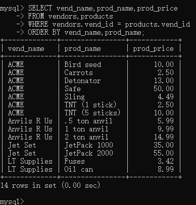


## 笛卡尔积

如果不使用where字句建立联结，那么返回的结果将是笛卡尔积。

```mysql
SELECT vend_name,prod_name,prod_price
FROM vendors,products
ORDER BY vend_name,prod_name;
```

下面是返回的结果。


- 笛卡尔积也被称为叉联结`cross join`。
- 两个集合的笛卡尔积，即两个集合的直积（A×B）。是所有可能有序对组成的集合。

所以在联结时一定不要忘了where字句。


## 内部联结

- 内部联结也称等值联结（equijoin），因为这种联结方式基于的是两个表中特定列的相等测试。
- INNER JOIN——ON。
- 使用规范的联结关键字，尽管where字句可以完成联结，但where字句可以进行的工作不仅只有联结，所以应该使用更规范的方式去完成联结，如下。

```mysql
SELECT vend_name,prod_name,prod_price
FROM vendors INNER JOIN products
ON vendors.vend_id = products.vend_id
ORDER BY vend_name,prod_name;
```

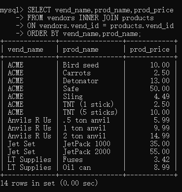


此语句的效果与上一个例子完全相同，尽管where语句完成定义更为简单，但这种方式更加规范。


## 多表联结

一条SELECT语句中进行联结的表的数目没有限制，也就是说可以在一条语句中进行数量大于二的多表联结。

```mysql
SELECT prod_name,vend_name,prod_price,quantity
FROM orderitems,products,vendors
WHERE products.vend_id = vendors.vend_id
	AND orderitems.prod_id = products.prod_id
	AND order_num = 20005;
```


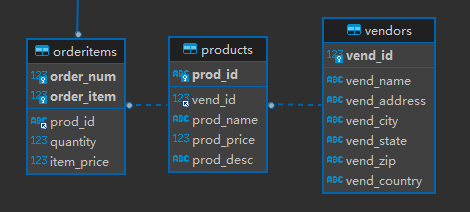

规范写法如下：

```mysql
SELECT prod_name,vend_name,prod_price,quantity
FROM orderitems INNER JOIN products INNER JOIN vendors
ON products.vend_id = vendors.vend_id 
	AND orderitems.prod_id = products.prod_id 
	AND order_num = 20005;
```


# 子查询与联结

在接触了子查询和连接后，不难发现，这两种机制其实可以进行相同的查询工作，差别在于二者的性能消耗。现在看下面这个例子：

```mysql
SELECT cust_name,cust_contact
FROM customers
WHERE cust_id IN (SELECT cust_id
                 FROM orders
                 WHERE order_num IN(SELECT order_num
                                   FROM orderitems
                                   WHERE prod_id = 'TNT2'));
```


```mysql
SELECT cust_name,cust_contact
FROM customers,orders,orderitems
WHERE customers.cust_id = orders.cust_id
	AND orderitems.order_num = orders.order_num
	AND prod_id = 'TNT2';
```

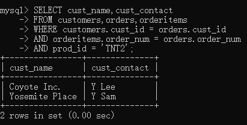


规范写法如下：

```mysql
SELECT cust_name,cust_contact
FROM customers INNER JOIN orders INNER JOIN orderitems
ON customers.cust_id = orders.cust_id
	AND orderitems.order_num = orders.order_num
	AND prod_id = 'TNT2';
```

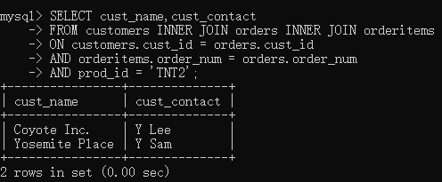

---

# 联结

## 内部联结

- 内部联结也称等值联结（equijoin），因为这种联结方式基于的是两个表中特定列的相等测试。
- INNER JOIN——ON。
- 使用规范的联结关键字，尽管where字句可以完成联结，但where字句可以进行的工作不仅只有联结，所以应该使用更规范的方式去完成联结，如下。

```mysql
SELECT vend_name,prod_name,prod_price
FROM vendors INNER JOIN products
ON vendors.vend_id = products.vend_id
ORDER BY vend_name,prod_name;
```


此语句的效果与上一个例子完全相同，尽管where语句完成定义更为简单，但这种方式更加规范。

# 高级联结

## 表别名

```mysql
SELECT cust_name,cust_contact
FROM customers AS c, orders AS o, orderitems AS oi
WHERE c.cust_id = o.cust_id
	AND oi.order_num = o.order_num
	AND prod_id = 'TNT2';
```


与列别名不同的是，表别名仅存在于查询执行过程中，而不像列别名那样，可以出现在返回的查询结果中。


## 自联结

```mysql
SELECT prod_id,prod_name
FROM products
WHERE vend_id = (SELECT vend_id
                FROM products
                WHERE prod_id = 'DTNTR');
```


这条语句使用了子查询，但内部查询和外部查询都是在同一个表中进行的，这种查询方式如果用联结的方式会消耗更少的性能，如下：

```mysql
SELECT p1.prod_id,p1.prod_name
FROM products AS p1, products AS p2
WHERE p1.vend_id = p2.vend_id
	AND p2.prod_id = 'DTNTR';
```


首先，联结语句必须表现出他是两个实例在联结，但现在数据查询仅涉及一个表，此时就需要使用到表别名，表别名很好的呈现了自联结的二义性，就像java中一个类中的两个实例一样。

```mysql
SELECT p1.prod_id,p1.prod_name
FROM products AS p1 INNER JOIN products AS p2
ON p1.vend_id = p2.vend_id
	AND p2.prod_id = 'DTNTR';
-- 规范写法
```


## 自然联结

什么是自然联结？

- 标准联结（等值联结）返回所有数据，这包括两张表中的公共列，而自然联结就是排除多次出现，使每个列都返回一次。
- 注意：我们迄今为止建立的每个内联结都是自然联结，很可能永远都不会用到不是自然联结的内联结。

```mysql
SELECT c.*, o.order_num, o.order_date, oi.prod_id, oi.quantity, oi.item_price
FROM customers AS c, orders AS o, orderitems AS oi
WHERE c.cust_id = o.cust_id
	AND oi.order_num = o.order_num
	AND prod_id = 'FB';
```

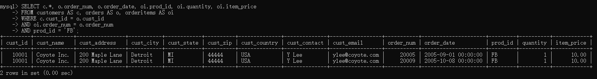


## 外部联结

许多联结将一个表中的行与另一个表中的行相关联。但有时候会需要包含没有关联行的那些行。

举个例子：

这是一个内联结，它将在两个表相关联的信息中完成检索。

```mysql
SELECT customers.cust_id,orders.order_num
FROM customers INNER JOIN orders
ON customers.cust_id = orders.cust_id;
```


- 这是一个外联结，相比内联结，它还将在两个表不相关联的信息中完成检索。
- `customers.cust_id`列中值为`10002`的行与`orders.cust_id`列没有任何关联。
- 在使用`OUT JOIN`语法时，必须使用`RIGHT`或`LEFT`关键字指定包括其所有行的表（`OUT JOIN`关键字的左右侧）。
  - 包含`cust_id`所有行的表是`customers`（`cust_id`为其主键）。

```mysql
SELECT customers.cust_id, orders.order_num
FROM customers LEFT OUTER JOIN orders
ON customers.cust_id = orders.cust_id;
```


---

# 全文本搜索

并非所有的引擎都支持全文本搜索。如常用的两个引擎`MyISAM`、`InnoDB`中，`InnoDB`就不支持全文本搜索，这一点需要注意！

为了进行全文本搜索，必须索引被搜索的列，而且要随着数据的改变不断地重新索引。在对表列进行适当设计后，MySQL会自动进行所有的索引和重新索引。

## 启用全文本搜索支持

```mysql
CREATE TABLE productnotes
(
note_id 	int           NOT NULL AUTO_INCREMENT,
prod_id 	char(10)      NOT NULL,
note_date 	datetime      NOT NULL,
note_text 	text          NULL,
PRIMARY KEY(note_id),
FULLTEXT(note_text)
)ENGINE=MyISAM;
```

子句`FULLTEXT()`指示对其中参数进行索引，它给出被索引列。

## 进行全文本搜索

在索引之后，使用两个函数`Match()`和`Against()`执行全文本搜索，其中`Match()`指定被搜索的列，`Against()`指定要使用的搜索表达式。

```mysql
SELECT note_text
FROM productnotes
WHERE Match(note_text) Against('rabbit');
-- Against('rabbit')：指定rabbit作为搜索文本。默认不区分大小写。
```


- 传递给`Match()`的值必须与`FULLTEXT()`定义中的相同。
- 全文本搜索会对结果进行排序。

展示全文本搜索排序的例子：

```mysql
SELECT note_text,
		Match(note_text) Against('rabbit') AS ranks
FROM productnotes;
```


更高分数的拥有更高的等级，排序按照等级的降序。

- 等级由MySQL根据行中词的数目、
- 唯一词的数目、
- 整个索引中的词总数
- 以及包含该词的行的数目_计算出来。


## 使用查询扩展

使用查询扩展，即让搜索变得更具包容性（宽松性）。

```mysql
SELECT note_text
FROM productnotes
WHERE Match(note_text) Against('anvils');
```


对比使用扩展查询后：

```mysql
SELECT note_text
FROM productnotes
WHERE Match(note_text) Against('anvils' WITH QUERY EXPANSION);
```


多出来的行虽然与给定检索信息无关，但是却与已被精准检索的语句有关，这就是查询扩展，它放宽了检索的条件，使我们更容易找到我们真正需要的信息。


## 布尔文本搜索

即使没有`FULLTEXT`索引，布尔文本搜索仍然可用，自然，如果没有索引，性能会变低。

返回的结果，“ 排列而不排序 ”。


下面的例子就算不使用布尔文本搜索，结果也是相同的。

```mysql
SELECT note_text
FROM productnotes
WHERE Match(note_text) Against('heavy' IN BOOLEAN MODE);
```

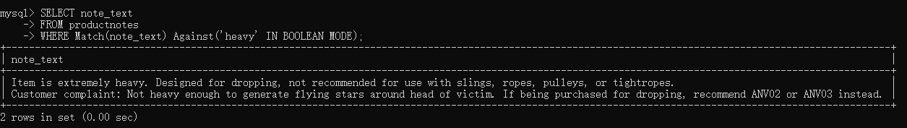

另一个例子：

```mysql
SELECT note_text
FROM productnotes
WHERE Match(note_text) Against('heavy -rope*' IN BOOLEAN MODE);
```


---

# 视图

`CREATE VIEW`：创建视图。

`SHOW CREATE VIEW viewname`：查看创建视图的语句。

`DROP VIEW viewname`：删除视图。

`先DROP再CREATE` 或是 `CREATE OR REPLACE VIEW`：更新视图（无论哪种方式，都是先删再建）。

如果说表是对散乱数据的整理，那么视图就是对散乱`SELECT`语句的整理。理论上来说，可以将所有`SELECT`语句保存为视图。

# 应用视图

- 要知道，视图是对`SELECT`语句的查询结果的操纵，而不是真正的表，且创建出来的视图也不是真正的表。
- 视图就是对查询结果的二次规划，对SQL的重用，对数据的保护，对语句的简化。
- 正是因为视图不是真正的数据表，所以这意味着如果过度使用视图，由于大量且频繁的嵌套，会造成不小的性能消耗！

## 简化联结

视图的最常见的应用之一就是隐藏复杂的SQL。

下面的语句创建了一个名为`productcustomers`的视图，并联结了三张表。

```mysql
CREATE VIEW productcustomers AS
SELECT cust_name, cust_contact, prod_id
FROM customers INNER JOIN orders INNER JOIN orderitems
ON customers.cust_id = orders.cust_id AND orderitems.order_num = orders.order_num;
```


使用：

```mysql
SELECT cust_name, cust_contact
FROM productcustomers
WHERE prod_id = 'TNT2';
```


## 保存检索数据

视图的另一常见用途是重新格式化检索出的数据。

下面是被检索出的数据用例：

```mysql
SELECT Concat(RTrim(vend_name),' (', RTrim(vend_country),')') AS vend_title
FROM vendors
ORDER BY vend_name;
```

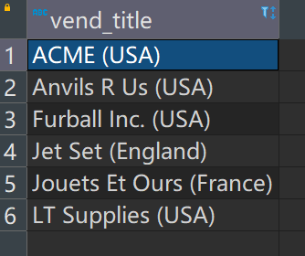

如果经常需要使用它，就把它创建为视图。

```mysql
CREATE VIEW vendorlocations AS
SELECT Concat(RTrim(vend_name),' (', RTrim(vend_country),')') AS vend_title
FROM vendors
ORDER BY vend_name;
```

检验一下：

```mysql
SELECT * FROM vendorlocations;
```


## 过滤数据

创建视图：

```mysql
CREATE VIEW customeremaillist AS
SELECT cust_id, cust_name, cust_email
FROM customers
WHERE cust_email IS NOT NULL;
```

过滤数据：

```mysql
SELECT *
FROM customeremaillist;
```


## 简化计算字段

用例：

```mysql
SELECT prod_id, quantity, item_price, quantity*item_price AS expanded_price
FROM orderitems
WHERE order_num = 20005;
```


创建视图：

```mysql
CREATE VIEW orderitemsexpanded AS
SELECT order_num, prod_id, quantity, item_price, quantity*item_price AS expanded_price
FROM orderitems;
```

简化计算字段：

```mysql
SELECT *
FROM orderitemsexpanded
WHERE order_num = 20005;
```


---

# 插入数据

## 插入完整的行

```mysql
INSERT INTO customers
VALUES(NULL,
      'Pep E. LaPew',
      '100 Main Street',
      'Los Angeles',
      'CA',
      '90046',
      'USA',
      NULL,
      NULL);
```


- 由于主键被定义为自动增量，所以在插入一条新数据时，由MySQL完成主键填充的工作。
- 这种插入数据的方式过于依赖各个列出现在实际表中的次序，这是一种非常不安全的插入方式。

更安全的插入方式：

```mysql
INSERT INTO LOW_PRIORITY customers(cus_name,
                     cust_address,
                     cust_city,
                     cust_state,
                     cust_zip,
                     cust_country,
                     cust_contact,
                     cust_email)
               VALUES('Pep E. LaPew',
                      '100 Main Street',
                      'Los Angeles',
                      'CA',
                      '90046',
                      'USA',
                      NULL,
                      NULL);
```

因为指定了列名，所以语句中的列名是可以各种顺序书写的。

从性能方面考虑，INSERT操作可能很耗时，且有可能会影响后续的SELECT操作，所以可以依据特定情况，降低INSERT语句的优先级。

> 很简单，只需要在`INSERT INTO`后加上`LOW_PRIORITY`即可。

```mysql
INSERT INTO LOW_PRIORITY customers VALUES(......);
```


## 插如多个行

```mysql
INSERT INTO customers(cust_name,
                     cust_address,
                     cust_city,
                     cust_state,
                     cust_zip,
                     cust_country)
               VALUES('Pep E. LaPew',
                      '100 Main Street',
                      'Los Angeles',
                      'CA',
                      '90046',
                      'USA');
          INSERT INTO customers(cust_name,
                      cust_address,
                      cust_city,
                      cust_state,
                      cust_zip,
                      cust_contry)
               VALUES('M. Martian',
                      '42 Galaxy Way',
                      'New YTork',
                      'NY',
                      '11213',
                      'USA');
```

也可如下定义（更轻松）。

```mysql
INSERT INTO customers(cust_name,
                     cust_address,
                     cust_city,
                     cust_state,
                     cust_zip,
                     cust_country)
               VALUES(
                         'Pep E. LaPew',
                         '100 Main Street',
                         'Los Angeles',
                         'CA',
                         '90046',
                         'USA'
                     ),
          			(
                         'M. Martian',
                         '42 Galaxy Way',
                         'New YTork',
                         'NY',
                         '11213',
                         'USA'
                     );
```

性能方面：一条多行插入数据的语句相比于多条单行插入语句将拥有更高的性能。


## 插入检索出的数据

```mysql
INSERT INTO customers(cust_id,
                     cust_contact,
                     cust_email,
                     cust_name,
                     cust_address,
                     cust_city,
                     cust_state,
                     cust_zip,
                     cust_country)
              SELECT cust_id,
                     cust_contact,
                     cust_email,
                     cust_name,
                     cust_address,
                     cust_city,
                     cust_state,
                     cust_zip,
                     cust_country
                FROM custnew;
```

- 如果被检索的数据中，主键列的数据与已有的数据不发生冲突，便可像上面这样进行插入。如果数据发生冲突（即有相同数据）则可以省略插入这列（同时在INSERT和SELECT）。
- 另外，SELECT部分的列名无需与INSERT部分的列名相同，插入是按照给出的列的顺序进行插入的，SELECT部分的列名仅是为了检索出表`custnew`中对应列的数据。

---

# 操纵表

# CREATE TABLE

## 创建表

```mysql
CREATE TABLE customers
(
  cust_id      int       NOT NULL AUTO_INCREMENT,
  cust_name    char(50)  NOT NULL ,
  cust_address char(50)  NULL ,
  cust_city    char(50)  NULL ,
  cust_state   char(5)   NULL ,
  cust_zip     char(10)  NULL ,
  cust_country char(50)  NULL ,
  cust_contact char(50)  NULL ,
  cust_email   char(255) NULL ,
  PRIMARY KEY (cust_id)
) ENGINE=InnoDB;
```

有关`AUTO_INCREMENT`

- `AUTO_INCREMENT`告诉MySQL，本列每当增加一行时自动增量。
- 每个表只允许一个`AUTO_INCREMENT`列。
- 由于自动增量不需要给出，所以当不清楚此列值时，可以使用`last_insert_id()`函数。
- `SELECT last_insert_id()` 意为：此语句返回最后一个`AUTO_INCREMENT`值。

---

如果主键由多列组成，就用逗号将多个主键列分隔：

```mysql
CREATE TABLE orderitems
(
  order_num  int          NOT NULL ,
  order_item int          NOT NULL ,
  prod_id    char(10)     NOT NULL ,
  quantity   int          NOT NULL DEFAULT 1,
  item_price decimal(8,2) NOT NULL ,
  PRIMARY KEY (order_num, order_item)
) ENGINE=InnoDB;
```

- 设置默认值使用`DEFAULT`关键字，当插入信息时未定义`quantity`则该行使用默认值`1`。
- `DEFAULT`默认值不支持函数定义，仅支持常量定义。

## 引擎类型

与其他DBMS一样，MySQL有一个具体管理和处理数据的内部引擎。

以下是几个需要知道的引擎：

- `InnoDB`是一个可靠的事务处理引擎，它不支持全文本搜索。
- `MENMORY`在功能等上同于`MYISAM`，但由于数据存储在内存（而非磁盘）中，速度很快（尤其适合于临时表）。
- `MYISAM`是一个性能极高的引擎，它支持全文本搜索，但不支持事务处理。

- 表之间的引擎可以不同，即可以混用引擎。
- 但不同引擎的表之间不能使用对方的外键，即外键不能跨引擎。

# ALTER TABLE

## 更新表

理想状态下，当表中存储数据以后，该表就不应该再被更新了。

### 添加列

给表添加一个列（例子中为在`vendors`表中添加一个名为`vend_phone`的列）：

```mysql
ALTER TABLE vendors
ADD vend_phone CHAR(20);
```

### 删除列

现在删除刚刚添加的那个列：

```mysql
ALTER TABLE vendors
DROP COLUMN vend_phone;
```

## 定义外键

`ALTER TABLE`的一个常见用途是定义外键。

```mysql
ALTER TABLE orderitems ADD CONSTRAINT fk_orderitems_orders FOREIGN KEY (order_num) REFERENCES orders (order_num);
ALTER TABLE orderitems ADD CONSTRAINT fk_orderitems_products FOREIGN KEY (prod_id) REFERENCES products (prod_id);
ALTER TABLE orders ADD CONSTRAINT fk_orders_customers FOREIGN KEY (cust_id) REFERENCES customers (cust_id);
ALTER TABLE products ADD CONSTRAINT fk_products_vendors FOREIGN KEY (vend_id) REFERENCES vendors (vend_id);
```


先对第一句定义外键的语句进行解释分析：

- 修改表`orderitems`，
- 对该表添加约束，`fk`是`foreign key`的缩写，将`orderitems`与`orders`进行约束关联。
- 定义外键为`order_num`，参照`orders`表的同名列进行取值。


## 删除表

```mysql
DROP TABLE customers2;
```

这样就删除了整个表，而非表的内容。

## 重命名表

```mysql
RENAME TABLE customers2 TO customers;
```

对多个表重命名：

```mysql
RENAME TABLE backup_customers TO customers,
			backup_products TO products;
```

---

# 更新表中数据

> 更新与删除

# UPDATE语句

## 更新单个列

```mysql
UPDATE customers
SET cust_email = 'elmer@fudd.com'
WHERE cust_id = 10005;
```

释译：更新表`customers`中`cust_id = 10005`的`cust_email`信息为`elmer@fudd.com`。

## 更新多个列

```mysql
UPDATE customers
SET cust_name = 'The Fudds',
    cust_email = 'elmer@fudd.com'
WHERE cust_id = 10005;
```

在更新数据的整个过程中，即使已经完成了一部分数据的更新操作，但只要发生一项错误，那么就会将所有数据（包括已更新）全部恢复为执行之前的状态。如果有需要，可以保留已更新成功的数据，那么需要使用关键字`IGNORE`。

```mysql
UPDATE IGNORE customers
SET ...... 
WHERE cust_id = 10005;
```


# DELETE语句

## 删除单行

```mysql
DELETE FROM customers
WHERE cust_id = 10006;
```

释译：删除`customers`表中`cust_id = 10006`的行。

`DELETE`语句不能删除列，只能删除行。

## 删除多行

可使用`TRUNCATE TABLE`代替`DELETE`语句来完成，速度会更快。

- 就像刚才说到的，删除所有行，这只能删除表中的数据，而不是删除表！`TRUNCATE TABLE`比`DELETE`拥有更快的删除速度的原因是其先删除了整个表，又重新创建了这个表，无论是二者的哪一个，都不能真正意义上的删除表。

# info

无论是`UPDATE`语句还是`DELETE`语句，如果不添加`where`字句，就会对整个表进行操作！

---

# 存储过程

我们知道，在`java`中，一个方法往往包含着几十条甚至上百条的语句，然而在调用时，我们只需要提供方法名即可，可以说，方法使得程序执行变得更加简洁、安全、易用。

而在MySQL的实际应用中，进行一项工作，往往也需要着相当多的SQL语句，而存储过程，就像`java`中的方法一样，对这些语句进行了封装，从而提高了工作的效率。
