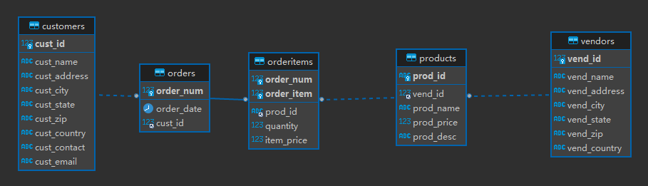

# 操纵表

# CREATE TABLE

## 创建表

```mysql
CREATE TABLE customers
(
  cust_id      int       NOT NULL AUTO_INCREMENT,
  cust_name    char(50)  NOT NULL ,
  cust_address char(50)  NULL ,
  cust_city    char(50)  NULL ,
  cust_state   char(5)   NULL ,
  cust_zip     char(10)  NULL ,
  cust_country char(50)  NULL ,
  cust_contact char(50)  NULL ,
  cust_email   char(255) NULL ,
  PRIMARY KEY (cust_id)
) ENGINE=InnoDB;
```

有关`AUTO_INCREMENT`

- `AUTO_INCREMENT`告诉MySQL，本列每当增加一行时自动增量。
- 每个表只允许一个`AUTO_INCREMENT`列。
- 由于自动增量不需要给出，所以当不清楚此列值时，可以使用`last_insert_id()`函数。
- `SELECT last_insert_id()` 意为：此语句返回最后一个`AUTO_INCREMENT`值。

---

如果主键由多列组成，就用逗号将多个主键列分隔：

```mysql
CREATE TABLE orderitems
(
  order_num  int          NOT NULL ,
  order_item int          NOT NULL ,
  prod_id    char(10)     NOT NULL ,
  quantity   int          NOT NULL DEFAULT 1,
  item_price decimal(8,2) NOT NULL ,
  PRIMARY KEY (order_num, order_item)
) ENGINE=InnoDB;
```

- 设置默认值使用`DEFAULT`关键字，当插入信息时未定义`quantity`则该行使用默认值`1`。
- `DEFAULT`默认值不支持函数定义，仅支持常量定义。

## 引擎类型

与其他DBMS一样，MySQL有一个具体管理和处理数据的内部引擎。

以下是几个需要知道的引擎：

- `InnoDB`是一个可靠的事务处理引擎，它不支持全文本搜索。
- `MENMORY`在功能等上同于`MYISAM`，但由于数据存储在内存（而非磁盘）中，速度很快（尤其适合于临时表）。
- `MYISAM`是一个性能极高的引擎，它支持全文本搜索，但不支持事务处理。

- 表之间的引擎可以不同，即可以混用引擎。
- 但不同引擎的表之间不能使用对方的外键，即外键不能跨引擎。

# ALTER TABLE

## 更新表

理想状态下，当表中存储数据以后，该表就不应该再被更新了。

### 添加列

给表添加一个列（例子中为在`vendors`表中添加一个名为`vend_phone`的列）：

```mysql
ALTER TABLE vendors
ADD vend_phone CHAR(20);
```

### 删除列

现在删除刚刚添加的那个列：

```mysql
ALTER TABLE vendors
DROP COLUMN vend_phone;
```

## 定义外键

`ALTER TABLE`的一个常见用途是定义外键。

```mysql
ALTER TABLE orderitems ADD CONSTRAINT fk_orderitems_orders FOREIGN KEY (order_num) REFERENCES orders (order_num);
ALTER TABLE orderitems ADD CONSTRAINT fk_orderitems_products FOREIGN KEY (prod_id) REFERENCES products (prod_id);
ALTER TABLE orders ADD CONSTRAINT fk_orders_customers FOREIGN KEY (cust_id) REFERENCES customers (cust_id);
ALTER TABLE products ADD CONSTRAINT fk_products_vendors FOREIGN KEY (vend_id) REFERENCES vendors (vend_id);
```



先对第一句定义外键的语句进行解释分析：

- 修改表`orderitems`，
- 对该表添加约束，`fk`是`foreign key`的缩写，将`orderitems`与`orders`进行约束关联。
- 定义外键为`order_num`，参照`orders`表的同名列进行取值。


## 删除表

```mysql
DROP TABLE customers2;
```

这样就删除了整个表，而非表的内容。

## 重命名表

```mysql
RENAME TABLE customers2 TO customers;
```

对多个表重命名：

```mysql
RENAME TABLE backup_customers TO customers,
			backup_products TO products;
```

