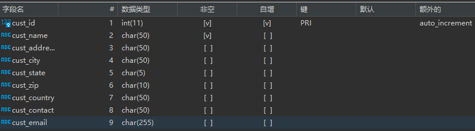

# 插入数据

## 插入完整的行

```mysql
INSERT INTO customers
VALUES(NULL,
      'Pep E. LaPew',
      '100 Main Street',
      'Los Angeles',
      'CA',
      '90046',
      'USA',
      NULL,
      NULL);
```



- 由于主键被定义为自动增量，所以在插入一条新数据时，由MySQL完成主键填充的工作。
- 这种插入数据的方式过于依赖各个列出现在实际表中的次序，这是一种非常不安全的插入方式。

更安全的插入方式：

```mysql
INSERT INTO LOW_PRIORITY customers(cus_name,
                     cust_address,
                     cust_city,
                     cust_state,
                     cust_zip,
                     cust_country,
                     cust_contact,
                     cust_email)
               VALUES('Pep E. LaPew',
                      '100 Main Street',
                      'Los Angeles',
                      'CA',
                      '90046',
                      'USA',
                      NULL,
                      NULL);
```

因为指定了列名，所以语句中的列名是可以各种顺序书写的。

从性能方面考虑，INSERT操作可能很耗时，且有可能会影响后续的SELECT操作，所以可以依据特定情况，降低INSERT语句的优先级。

> 很简单，只需要在`INSERT INTO`后加上`LOW_PRIORITY`即可。

```mysql
INSERT INTO LOW_PRIORITY customers VALUES(......);
```


## 插如多个行

```mysql
INSERT INTO customers(cust_name,
                     cust_address,
                     cust_city,
                     cust_state,
                     cust_zip,
                     cust_country)
               VALUES('Pep E. LaPew',
                      '100 Main Street',
                      'Los Angeles',
                      'CA',
                      '90046',
                      'USA');
          INSERT INTO customers(cust_name,
                      cust_address,
                      cust_city,
                      cust_state,
                      cust_zip,
                      cust_contry)
               VALUES('M. Martian',
                      '42 Galaxy Way',
                      'New YTork',
                      'NY',
                      '11213',
                      'USA');
```

也可如下定义（更轻松）。

```mysql
INSERT INTO customers(cust_name,
                     cust_address,
                     cust_city,
                     cust_state,
                     cust_zip,
                     cust_country)
               VALUES(
                         'Pep E. LaPew',
                         '100 Main Street',
                         'Los Angeles',
                         'CA',
                         '90046',
                         'USA'
                     ),
          			(
                         'M. Martian',
                         '42 Galaxy Way',
                         'New YTork',
                         'NY',
                         '11213',
                         'USA'
                     );
```

性能方面：一条多行插入数据的语句相比于多条单行插入语句将拥有更高的性能。


## 插入检索出的数据

```mysql
INSERT INTO customers(cust_id,
                     cust_contact,
                     cust_email,
                     cust_name,
                     cust_address,
                     cust_city,
                     cust_state,
                     cust_zip,
                     cust_country)
              SELECT cust_id,
                     cust_contact,
                     cust_email,
                     cust_name,
                     cust_address,
                     cust_city,
                     cust_state,
                     cust_zip,
                     cust_country
                FROM custnew;
```

- 如果被检索的数据中，主键列的数据与已有的数据不发生冲突，便可像上面这样进行插入。如果数据发生冲突（即有相同数据）则可以省略插入这列（同时在INSERT和SELECT）。
- 另外，SELECT部分的列名无需与INSERT部分的列名相同，插入是按照给出的列的顺序进行插入的，SELECT部分的列名仅是为了检索出表`custnew`中对应列的数据。

