> 本文档归属于`select`文档，因正则表达式的特殊性，所以将其作为分文档进行了解。
>
> 正则表达式本身是一个非常庞大的知识概念，MySQL中的正则表达式仅仅是其的一个子集。

# 正则表达式

​	正则表达式是用来匹配文本的特殊字符集合。


## 字符类

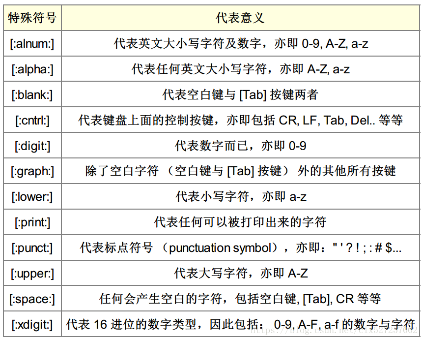


## 重复元字符

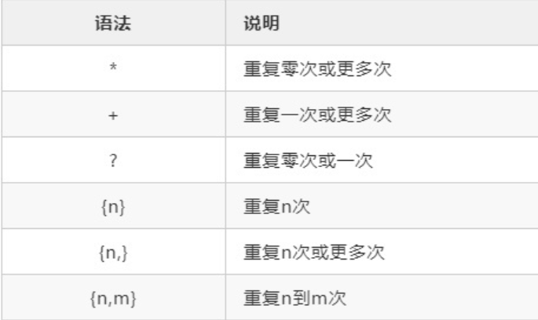


## 定位元字符

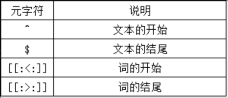


## REGEXP关键字

```mysql
SELECT prod_name
FROM products
WHERE prod_name REGEXP '1000'
ORDER BY prod_name;
-- REGEXP就像like，只不过like是MySQL的自定语义，而REGEXP则表示正则表达式的引用。
-- 很明显，'1000'就是一个正则表达式。
```


下面是一个较为正式的正则表达式的例子：

```mysql
SELECT prod_name
FROM products
WHERE prod_name REGEXP '.000'
ORDER BY prod_name;
```


```mysql
SELECT prod_name
FROM products
WHERE prod_name REGEXP '1000|2000'
ORDER BY prod_name;
-- "|"类似MySQL中的OR操作符。
```

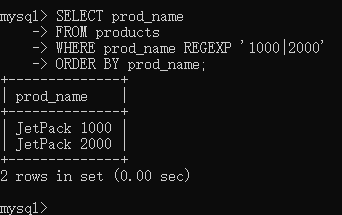


```mysql
SELECT prod_name
FROM products
WHERE prod_name REGEXP '[123] Ton'
ORDER BY prod_name;
-- '[123] Ton'是'[1|2|3] Ton'的缩写，类似IN操作符。
```


```mysql
SELECT prod_name
FROM products
WHERE prod_name REGEXP '[^123] Ton'
ORDER BY prod_name;
-- 排除型字符集合
```

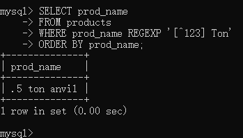


```mysql
SELECT prod_name
FROM products
WHERE prod_name REGEXP '[1-5] Ton'
ORDER BY prod_name;
-- 1到5
```

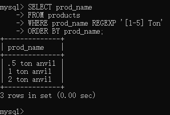


```mysql
SELECT vend_name
FROM vendors
WHERE vend_name REGEXP '\\.'
ORDER BY vend_name;
-- 由于正则表达式所用到的字符和所检索的数据发生了冲突，所以使用"\\"来消除歧义（转义）。类似的还可以'\\-'，表示匹配“-”。
-- 如果要匹配反斜杠本身\，则使用“\\\”。
```

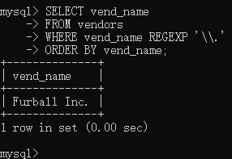


```mysql
SELECT prod_name 
FROM products 
WHERE prod_name REGEXP '\\([0-9] sticks?\\)' 
ORDER BY prod_name;
-- "?"代表0或1个字符。
-- 反斜杠的转义效果只有一次！
-- 这意味着在正则表达式中，每当想表达普通字符时，都要使用反斜杠，所以REGEXP后出现了两次反斜杠，他们的作用都是对括号进行转义。
```

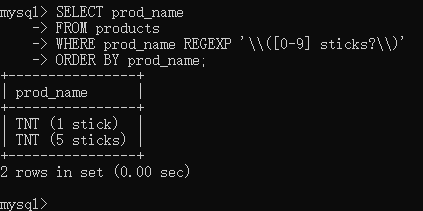


```mysql
SELECT prod_name
FROM products
WHERE prod_name REGEXP '[[:digit:]]{4}'
ORDER BY prod_name;
-- '[[:digit:]]{4}'的另一种写法是'[0-9][0-9][0-9][0-9]'
```

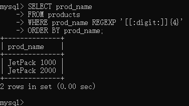


```mysql
SELECT prod_name
FROM products
WHERE prod_name REGEXP '^[0-9\\.]'
ORDER BY prod_name;
-- "^"匹配字符串的开始，也就是说[0123456789.]其中任意一个必须为字符串的开头第一个字符。
```

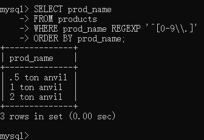


```mysql
SELECT prod_name
FROM products
WHERE prod_name REGEXP '[0-9\\.]'
ORDER BY prod_name;
-- "^" 有两种含义："否定集合[]。" 或是 "文本的开始。"
```

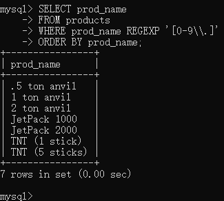

# END

正则表达式不依赖数据库中的表，REGEXP检查的结果只有两个：

>0：没有匹配
>
>1：匹配

所以可以这样来进行测试：

```mysql
SELECT 'hello' REGEXP '[0-9]';
-- hello字符串中当然没有数字，显然返回的是0.
```

