# 聚集函数

聚集函数的主要作用就是对数据进行汇总，在进行数据汇总工作时，聚集函数在提高性能方面有很好的效果。

## `AVG()`函数

```mysql
SELECT AVG(prod_price) AS avg_price
FROM products;
-- 返回特定列的平均值。
```

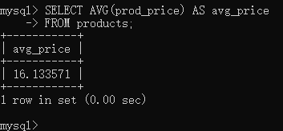


```mysql
SELECT AVG(prod_price) AS avg_price
FROM products
WHERE vend_id = 1003;
-- AVG()只能选择一列，这意味AVG()和列的关系是一对一的。
-- 忽略NULL.
```

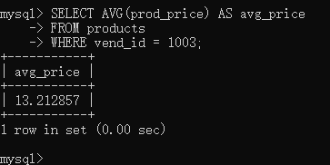


## `COUNT()`函数

```mysql
SELECT COUNT(*) AS num_cust
FROM customers;
-- COUNT()函数的作用是计数（统计），例如对整个表中行数目进行统计。
```

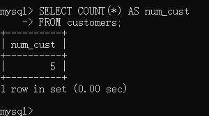


```mysql
SELECT * FROM customers;
```

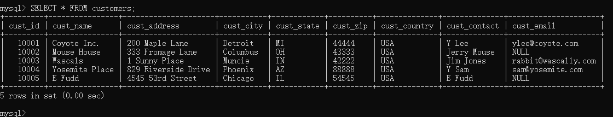


```mysql
SELECT COUNT(cust_email) AS num_cust
FROM customers;
-- 统计特定列时，对于null行将不会进行计数。
-- 而统计整个表时（*），是对所有行进行的计数。
```


## `MAX()`函数

```mysql
SELECT MAX(prod_price) AS max_price
FROM products;
-- 返回指定列中的最大值。要求指定列名。
-- 对于文本，将返回最后面的行。
-- 忽略NULL.
```

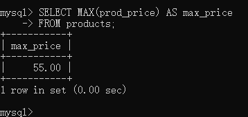


## `MIN()`函数

```mysql
SELECT MIN(prod_price) AS min_price
FROM products;
-- 返回指定列中的最小值。要求指定列名。
-- 对于文本，将返回最前面的行。
-- 忽略NULL.
```

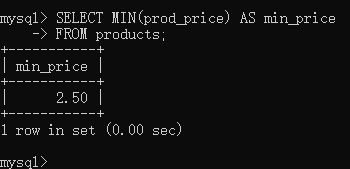


## `SUM()`函数

```mysql
SELECT SUM(quantity) AS items_ordered
FROM orderitems
WHERE order_num = 20005;
-- 特定列值的和（总计）。
-- 忽略NULL.
```

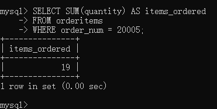


```mysql
SELECT SUM(item_price*quantity) AS total_price
FROM orderitems
WHERE order_num = 20005;
-- 合计计算（将两列数据进行计算后再求和）
```


## 聚集中的DISTINCT

```mysql
SELECT AVG(DISTINCT prod_price) AS avg_price
FROM products
WHERE vend_id = 1003;
-- 这样将只会选取不同的价格进行求平均值计算，相同的数值将不会被采纳。
```

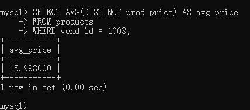


## 组合

```mysql
SELECT COUNT(*) AS num_items,
MIN(prod_price) AS price_min,
MAX(prod_price) AS price_max,
AVG(prod_price) AS price_avg
FROM products;
```


# 分组数据

## GROUP BY

```mysql
SELECT vend_id,COUNT(*) AS num_prods
FROM products
GROUP BY vend_id;
-- 分组后，COUNT()会对分组的数据进行分组统计。
```


```mysql
SELECT vend_id,COUNT(*) AS num_prods
FROM products
GROUP BY vend_id WITH ROLLUP;
-- 分组的汇总，由于并未对分组的汇总指定vend_id，所以为null。
-- 计算字段（数据处理函数）的工作属于是对检索数据的再整理，并不影响元数据，所以即便是主键也可以使用WITH ROLLUP进行分组汇总。
```

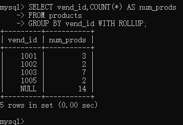


## HAVING

HAVING的工作是过滤分组，之前学过的WHERE是过滤数据，但因为WHERE不能过滤分组，所以使用了HAVING。但现在情况反了过来，HAVING不仅支持过滤分组，也同样拥有WHERE所具有的一切功能。

```mysql
SELECT * FROM products WHERE vend_id = 1003;
```

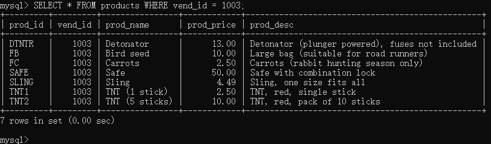

```mysql
SELECT * FROM products HAVING vend_id = 1003;
```


显然，WHERE能做的，HAVING也能做。不同的是WHERE过滤的是分组前的数据，而HAVING过滤的是分组后的数据。

```mysql
SELECT cust_id,COUNT(*) AS orders
FROM orders
GROUP BY cust_id
HAVING COUNT(*) >= 2;
-- 包含过滤条件：组数 >= 2
```


当然，WHERE和HAVING可以组合使用，但由于二者的特性，规定，HAVING必须放在WHERE后使用，否则会报错。

```mysql
SELECT * FROM products WHERE vend_id = 1003 HAVING prod_id = 'FB';
```


下面的写法更加标准。

```mysql
SELECT vend_id,COUNT(*) AS num_prods
FROM products
WHERE prod_price >=10
GROUP BY vend_id
HAVING COUNT(*) >=2;
```


```mysql
SELECT vend_id,COUNT(*) AS num_prods
FROM products
GROUP BY vend_id
HAVING COUNT(*) >=2;
-- 这是去掉where部分的语句。
```

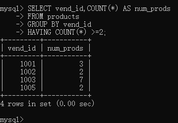


## 结合ORDER BY

```mysql
SELECT order_num,SUM(quantity*item_price) AS ordertotal
FROM orderitems
GROUP BY order_num
HAVING SUM(quantity*item_price) >= 50
ORDER BY ordertotal;
```

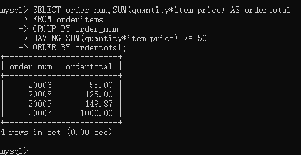

