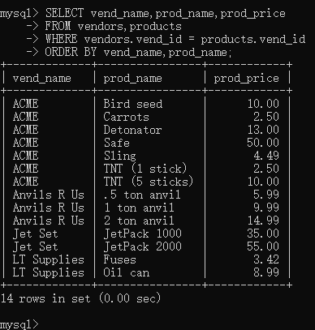
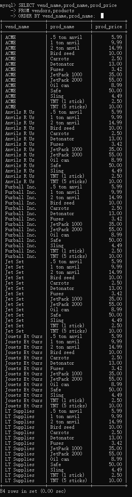
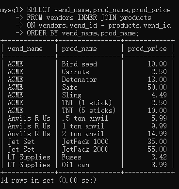
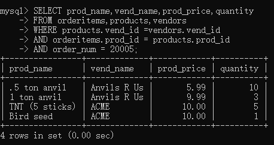
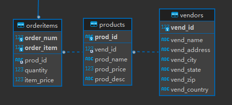
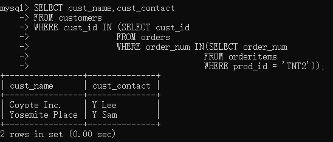
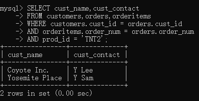
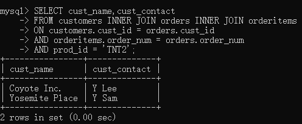

# 联结

联结是一种机制，用来在一条`SELECT`语句中关联表，因此称之为联结。

由于数据冗余会降低数据库的性能，所以良好的数据库都会尽量避免数据冗余来换取更好可伸缩性。作为存储方来说，这样的数据库是优秀的，但作为提取方，在数据检索时，这种设计思想却成为了数据检索的问题，就是如何更轻量化的完成数据的精细检索？联结就是这个问题的解决方案，既然数据在存储时被分散了，那么就在提取时重新联结成整体从而方便接下来工作的进行。


## 联结的特性

联结与之前的数据处理函数的生命周期类似，都是在查询时开始，查询完成后结束，不会修改真正的数据表，更不是真正的数据表，而仅仅是这个过程中的一种临时产物。


## 创建联结

多说无益，按照惯例：

```mysql
SELECT vend_name,prod_name,prod_price
FROM vendors,products
WHERE vendors.vend_id = products.vend_id
ORDER BY vend_name,prod_name;
-- vendor_id是vendors表的主键，也是products表的MUL。
-- 这样，就通过WHERE字句建立了联结。
```




## 笛卡尔积

如果不使用where字句建立联结，那么返回的结果将是笛卡尔积。

```mysql
SELECT vend_name,prod_name,prod_price
FROM vendors,products
ORDER BY vend_name,prod_name;
```

下面是返回的结果。



- 笛卡尔积也被称为叉联结`cross join`。
- 两个集合的笛卡尔积，即两个集合的直积（A×B）。是所有可能有序对组成的集合。

所以在联结时一定不要忘了where字句。


## 内部联结

- 内部联结也称等值联结（equijoin），因为这种联结方式基于的是两个表中特定列的相等测试。
- INNER JOIN——ON。
- 使用规范的联结关键字，尽管where字句可以完成联结，但where字句可以进行的工作不仅只有联结，所以应该使用更规范的方式去完成联结，如下。

```mysql
SELECT vend_name,prod_name,prod_price
FROM vendors INNER JOIN products
ON vendors.vend_id = products.vend_id
ORDER BY vend_name,prod_name;
```




此语句的效果与上一个例子完全相同，尽管where语句完成定义更为简单，但这种方式更加规范。


## 多表联结

一条SELECT语句中进行联结的表的数目没有限制，也就是说可以在一条语句中进行数量大于二的多表联结。

```mysql
SELECT prod_name,vend_name,prod_price,quantity
FROM orderitems,products,vendors
WHERE products.vend_id = vendors.vend_id
	AND orderitems.prod_id = products.prod_id
	AND order_num = 20005;
```





规范写法如下：

```mysql
SELECT prod_name,vend_name,prod_price,quantity
FROM orderitems INNER JOIN products INNER JOIN vendors
ON products.vend_id = vendors.vend_id 
	AND orderitems.prod_id = products.prod_id 
	AND order_num = 20005;
```


# 子查询与联结

在接触了子查询和连接后，不难发现，这两种机制其实可以进行相同的查询工作，差别在于二者的性能消耗。现在看下面这个例子：

```mysql
SELECT cust_name,cust_contact
FROM customers
WHERE cust_id IN (SELECT cust_id
                 FROM orders
                 WHERE order_num IN(SELECT order_num
                                   FROM orderitems
                                   WHERE prod_id = 'TNT2'));
```



```mysql
SELECT cust_name,cust_contact
FROM customers,orders,orderitems
WHERE customers.cust_id = orders.cust_id
	AND orderitems.order_num = orders.order_num
	AND prod_id = 'TNT2';
```




规范写法如下：

```mysql
SELECT cust_name,cust_contact
FROM customers INNER JOIN orders INNER JOIN orderitems
ON customers.cust_id = orders.cust_id
	AND orderitems.order_num = orders.order_num
	AND prod_id = 'TNT2';
```



