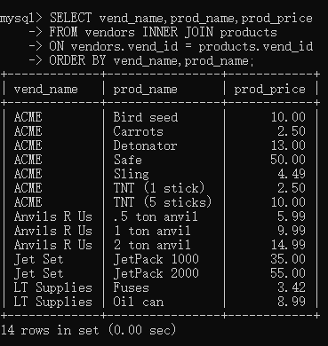
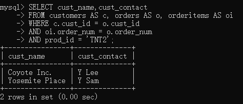
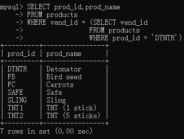
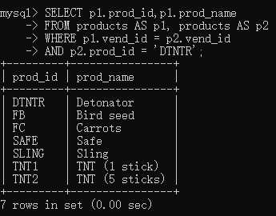
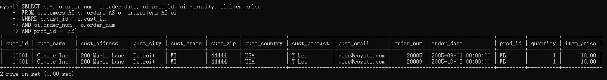
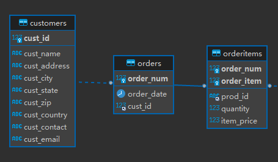
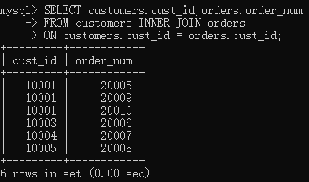
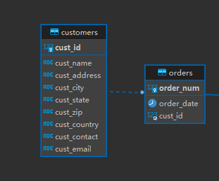

# 联结

## 内部联结

- 内部联结也称等值联结（equijoin），因为这种联结方式基于的是两个表中特定列的相等测试。
- INNER JOIN——ON。
- 使用规范的联结关键字，尽管where字句可以完成联结，但where字句可以进行的工作不仅只有联结，所以应该使用更规范的方式去完成联结，如下。

```mysql
SELECT vend_name,prod_name,prod_price
FROM vendors INNER JOIN products
ON vendors.vend_id = products.vend_id
ORDER BY vend_name,prod_name;
```




此语句的效果与上一个例子完全相同，尽管where语句完成定义更为简单，但这种方式更加规范。

# 高级联结

## 表别名

```mysql
SELECT cust_name,cust_contact
FROM customers AS c, orders AS o, orderitems AS oi
WHERE c.cust_id = o.cust_id
	AND oi.order_num = o.order_num
	AND prod_id = 'TNT2';
```



与列别名不同的是，表别名仅存在于查询执行过程中，而不像列别名那样，可以出现在返回的查询结果中。


## 自联结

```mysql
SELECT prod_id,prod_name
FROM products
WHERE vend_id = (SELECT vend_id
                FROM products
                WHERE prod_id = 'DTNTR');
```



这条语句使用了子查询，但内部查询和外部查询都是在同一个表中进行的，这种查询方式如果用联结的方式会消耗更少的性能，如下：

```mysql
SELECT p1.prod_id,p1.prod_name
FROM products AS p1, products AS p2
WHERE p1.vend_id = p2.vend_id
	AND p2.prod_id = 'DTNTR';
```



首先，联结语句必须表现出他是两个实例在联结，但现在数据查询仅涉及一个表，此时就需要使用到表别名，表别名很好的呈现了自联结的二义性，就像java中一个类中的两个实例一样。

```mysql
SELECT p1.prod_id,p1.prod_name
FROM products AS p1 INNER JOIN products AS p2
ON p1.vend_id = p2.vend_id
	AND p2.prod_id = 'DTNTR';
-- 规范写法
```


## 自然联结

什么是自然联结？

- 标准联结（等值联结）返回所有数据，这包括两张表中的公共列，而自然联结就是排除多次出现，使每个列都返回一次。
- 注意：我们迄今为止建立的每个内联结都是自然联结，很可能永远都不会用到不是自然联结的内联结。

```mysql
SELECT c.*, o.order_num, o.order_date, oi.prod_id, oi.quantity, oi.item_price
FROM customers AS c, orders AS o, orderitems AS oi
WHERE c.cust_id = o.cust_id
	AND oi.order_num = o.order_num
	AND prod_id = 'FB';
```






## 外部联结

许多联结将一个表中的行与另一个表中的行相关联。但有时候会需要包含没有关联行的那些行。

举个例子：

这是一个内联结，它将在两个表相关联的信息中完成检索。

```mysql
SELECT customers.cust_id,orders.order_num
FROM customers INNER JOIN orders
ON customers.cust_id = orders.cust_id;
```



- 这是一个外联结，相比内联结，它还将在两个表不相关联的信息中完成检索。
- `customers.cust_id`列中值为`10002`的行与`orders.cust_id`列没有任何关联。
- 在使用`OUT JOIN`语法时，必须使用`RIGHT`或`LEFT`关键字指定包括其所有行的表（`OUT JOIN`关键字的左右侧）。
  - 包含`cust_id`所有行的表是`customers`（`cust_id`为其主键）。

```mysql
SELECT customers.cust_id, orders.order_num
FROM customers LEFT OUTER JOIN orders
ON customers.cust_id = orders.cust_id;
```



