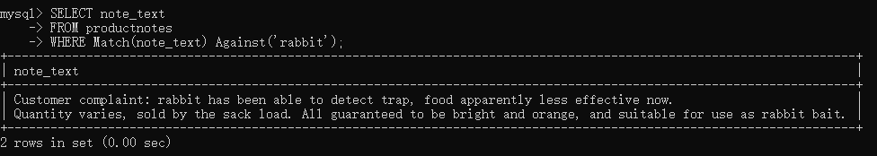
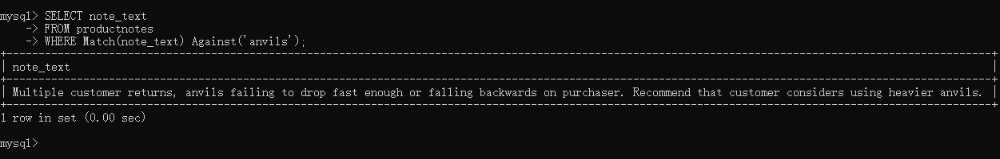
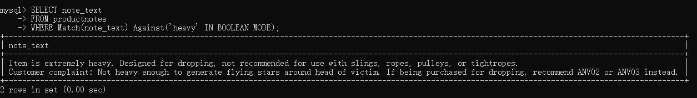

# 全文本搜索

并非所有的引擎都支持全文本搜索。如常用的两个引擎`MyISAM`、`InnoDB`中，`InnoDB`就不支持全文本搜索，这一点需要注意！

为了进行全文本搜索，必须索引被搜索的列，而且要随着数据的改变不断地重新索引。在对表列进行适当设计后，MySQL会自动进行所有的索引和重新索引。

## 启用全文本搜索支持

```mysql
CREATE TABLE productnotes
(
note_id 	int           NOT NULL AUTO_INCREMENT,
prod_id 	char(10)      NOT NULL,
note_date 	datetime      NOT NULL,
note_text 	text          NULL,
PRIMARY KEY(note_id),
FULLTEXT(note_text)
)ENGINE=MyISAM;
```

子句`FULLTEXT()`指示对其中参数进行索引，它给出被索引列。

## 进行全文本搜索

在索引之后，使用两个函数`Match()`和`Against()`执行全文本搜索，其中`Match()`指定被搜索的列，`Against()`指定要使用的搜索表达式。

```mysql
SELECT note_text
FROM productnotes
WHERE Match(note_text) Against('rabbit');
-- Against('rabbit')：指定rabbit作为搜索文本。默认不区分大小写。
```



- 传递给`Match()`的值必须与`FULLTEXT()`定义中的相同。
- 全文本搜索会对结果进行排序。

展示全文本搜索排序的例子：

```mysql
SELECT note_text,
		Match(note_text) Against('rabbit') AS ranks
FROM productnotes;
```


更高分数的拥有更高的等级，排序按照等级的降序。

- 等级由MySQL根据行中词的数目、
- 唯一词的数目、
- 整个索引中的词总数
- 以及包含该词的行的数目_计算出来。


## 使用查询扩展

使用查询扩展，即让搜索变得更具包容性（宽松性）。

```mysql
SELECT note_text
FROM productnotes
WHERE Match(note_text) Against('anvils');
```



对比使用扩展查询后：

```mysql
SELECT note_text
FROM productnotes
WHERE Match(note_text) Against('anvils' WITH QUERY EXPANSION);
```


多出来的行虽然与给定检索信息无关，但是却与已被精准检索的语句有关，这就是查询扩展，它放宽了检索的条件，使我们更容易找到我们真正需要的信息。


## 布尔文本搜索

即使没有`FULLTEXT`索引，布尔文本搜索仍然可用，自然，如果没有索引，性能会变低。

返回的结果，“ 排列而不排序 ”。


下面的例子就算不使用布尔文本搜索，结果也是相同的。

```mysql
SELECT note_text
FROM productnotes
WHERE Match(note_text) Against('heavy' IN BOOLEAN MODE);
```



另一个例子：

```mysql
SELECT note_text
FROM productnotes
WHERE Match(note_text) Against('heavy -rope*' IN BOOLEAN MODE);
```


