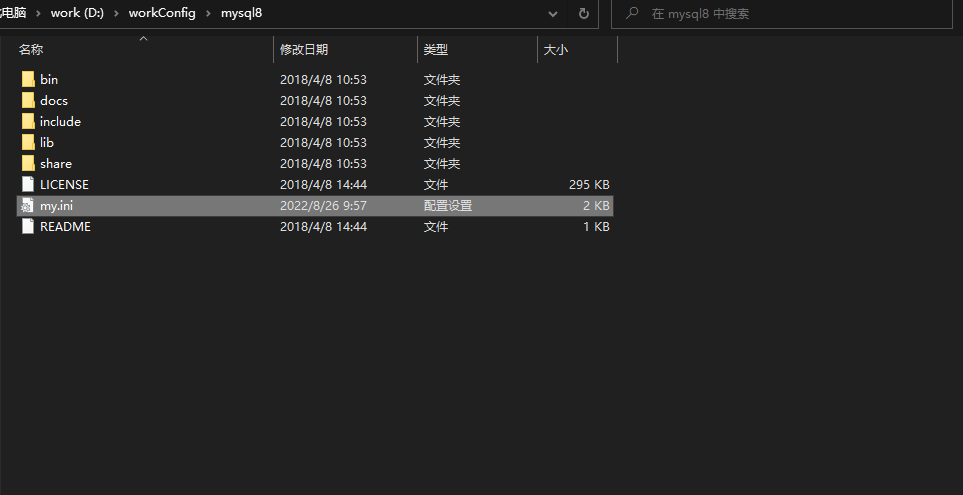
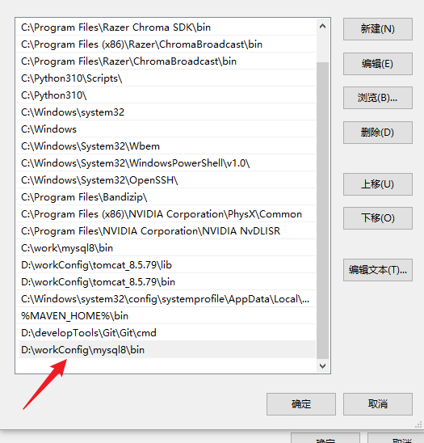
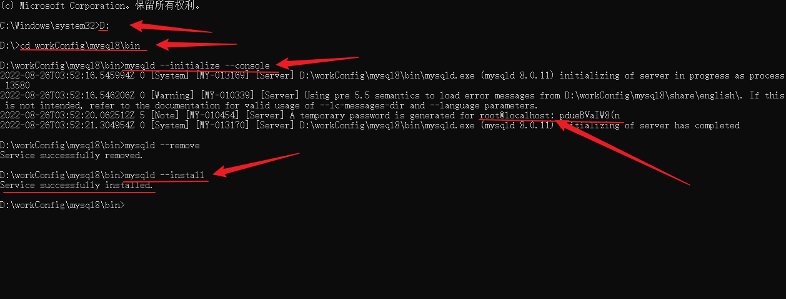
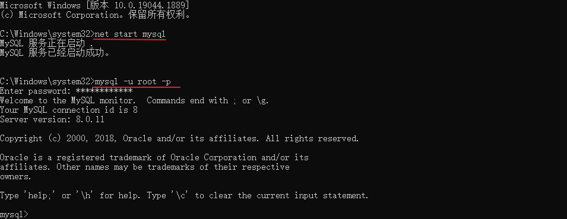

# MySQL安装步骤

## step 1：下载文件

---

下载链接：[MySQL安装](https://dev.mysql.com/downloads/file/?id=476233%EF%BC%89)


## step 2：配置文件

---

创建一个新的ini文件。



内容如下：

```ini
[mysqld]
# 必看说明：！！！
# 1. 此代码中所有#开头的句子都可以删除
# 2. 此代码中全部使用双\\，以防转义字符出现问题
# 设置3306端口
port=3306
# 设置mysql的安装目录
# basedir=D:\\ROUTE\\mysql8
# 设置错误信息存放目录，一定注意找到对应的"english"文件夹！！
lc-messages-dir=D:\\workConfig\\mysql8\\share\\english
# 设置mysql数据库的数据的存放目录
datadir=D:\\workConfig\\mysql8\\Data   
# 此处同上
# 允许最大连接数
max_connections=200
# 允许连接失败的次数。这是为了防止有人从该主机试图攻击数据库系统
max_connect_errors=10
# 服务端使用的字符集默认为UTF8
character-set-server=utf8
# 创建新表时将使用的默认存储引擎
default-storage-engine=INNODB
# 默认使用“mysql_native_password”插件认证
default_authentication_plugin=mysql_native_password
[mysql]
# 设置mysql客户端默认字符集
default-character-set=utf8
[client]
# 设置mysql客户端连接服务端时默认使用的端口
port=3306
default-character-set=utf8
[WinMySQLAdmin]
Server=D:\workConfig\mysql8\bin\mysqld.exe	
#设置将mysql的服务添加到注册表中，反正我当时没加这句话初始化有问题，目录照猫画虎，单双杠自己选
```


## step 3：环境变量

---

配置环境变量。





## step4：初始化

---

1、数据库初始化。

> `@localhost`后跟着的是初始密码。



2、安装完成。


3、修改密码。



4、大功告成。

