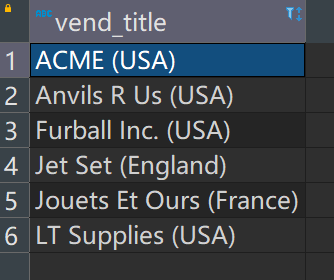
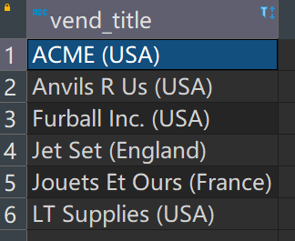
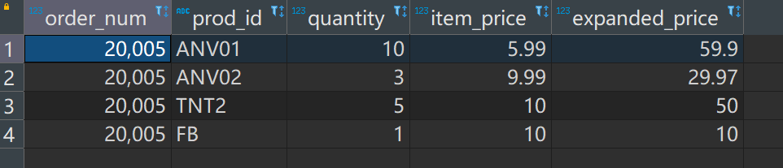

# 视图

`CREATE VIEW`：创建视图。

`SHOW CREATE VIEW viewname`：查看创建视图的语句。

`DROP VIEW viewname`：删除视图。

`先DROP再CREATE` 或是 `CREATE OR REPLACE VIEW`：更新视图（无论哪种方式，都是先删再建）。

如果说表是对散乱数据的整理，那么视图就是对散乱`SELECT`语句的整理。理论上来说，可以将所有`SELECT`语句保存为视图。

# 应用视图

- 要知道，视图是对`SELECT`语句的查询结果的操纵，而不是真正的表，且创建出来的视图也不是真正的表。
- 视图就是对查询结果的二次规划，对SQL的重用，对数据的保护，对语句的简化。
- 正是因为视图不是真正的数据表，所以这意味着如果过度使用视图，由于大量且频繁的嵌套，会造成不小的性能消耗！

## 简化联结

视图的最常见的应用之一就是隐藏复杂的SQL。

下面的语句创建了一个名为`productcustomers`的视图，并联结了三张表。

```mysql
CREATE VIEW productcustomers AS
SELECT cust_name, cust_contact, prod_id
FROM customers INNER JOIN orders INNER JOIN orderitems
ON customers.cust_id = orders.cust_id AND orderitems.order_num = orders.order_num;
```


使用：

```mysql
SELECT cust_name, cust_contact
FROM productcustomers
WHERE prod_id = 'TNT2';
```


## 保存检索数据

视图的另一常见用途是重新格式化检索出的数据。

下面是被检索出的数据用例：

```mysql
SELECT Concat(RTrim(vend_name),' (', RTrim(vend_country),')') AS vend_title
FROM vendors
ORDER BY vend_name;
```



如果经常需要使用它，就把它创建为视图。

```mysql
CREATE VIEW vendorlocations AS
SELECT Concat(RTrim(vend_name),' (', RTrim(vend_country),')') AS vend_title
FROM vendors
ORDER BY vend_name;
```

检验一下：

```mysql
SELECT * FROM vendorlocations;
```



## 过滤数据

创建视图：

```mysql
CREATE VIEW customeremaillist AS
SELECT cust_id, cust_name, cust_email
FROM customers
WHERE cust_email IS NOT NULL;
```

过滤数据：

```mysql
SELECT *
FROM customeremaillist;
```


## 简化计算字段

用例：

```mysql
SELECT prod_id, quantity, item_price, quantity*item_price AS expanded_price
FROM orderitems
WHERE order_num = 20005;
```


创建视图：

```mysql
CREATE VIEW orderitemsexpanded AS
SELECT order_num, prod_id, quantity, item_price, quantity*item_price AS expanded_price
FROM orderitems;
```

简化计算字段：

```mysql
SELECT *
FROM orderitemsexpanded
WHERE order_num = 20005;
```

