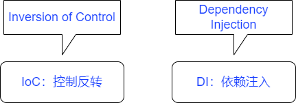

# 一、动态代理

- **含义**：指的是在程序的运行过程中为某一真实对象动态的生成一个代理对象。

- **思想**：为真实对象生成一个占位去与调用者进行交互，这种关系更像是中间人。

  ​		   从始至终用户都接触不到真实对象，但工作却仍由真实对象进行。

动态代理技术有很多种，其中spring中常用的为以下两种。

## JDK动态代理

- 必须借助一个接口才能产生代理对象。

- 需要定义接口和实现类才能开始编写代理类。

- 代理类需要实现（java.lang.reflect.InvocationHandler）接口。

  >Invocation Handler：调用处理程序

**代理类**

- 创建绑定方法（将真实对象与代理对象进行绑定，并返回代理对象）
- 实现代理逻辑

```java
public class JdkProxyExample implements InvocationHandler {
    private Object target = null;		//创建真实对象

    public Object bind(Object target) {
        this.target = target;
        //创建代理对象，需要三个数据（参数）：真实对象的类加载器|代理对象的目标位置|实现代理逻辑的类
        return Proxy.newProxyInstance(target.getClass().getClassLoader(), 
                                      target.getClass().getInterfaces(),
                                      this);
    }

    @Override
    public Object invoke(Object proxy, Method method, Object[] args) throws Throwable {
        System.out.println("进入代理逻辑方法");
        System.out.println("进行调度真实对象之前的服务");
        Object obj = method.invoke(target, args);
        System.out.println("进行调度真实对象之后的服务");
        return obj;
    }
}
```

**测试类**

```java
public void testProxy() {
        JdkProxyExample jdk = new JdkProxyExample();		//创建代理类对象
    
    	//创建代理对象，接下来会由代理对象去调用方法，但实际上还是由真实对象完成
        HelloWorld proxy = (HelloWorld) jdk.bind(new HelloWorldImpl());
        proxy.sayHelloWorld();
    }
```

## CGLIB动态代理

- 无需借助接口便可完成代理功能，适用于不使用接口的时候使用。

- 代理类需要实现第三方（net.sf.cglib.proxy.MethodInterceptor）接口。

  >Method Interceptor：方法拦截器
  >
  >enhancer：增强者
  >
  >intercept：拦截

**代理类**

- 返回代理对象的方法
- 实现代理逻辑方法

```java
public class CglibProxyExample implements MethodInterceptor {

    public Object getProxy(Class cls) {
        Enhancer enhancer = new Enhancer();
        enhancer.setSuperclass(cls);				// 设置超类      真实对象所处的类
        enhancer.setCallback(this);					// 设置代理类    实现代理方法的类
        return enhancer.create();					// 返回代理对象
    }

    @Override
    public Object intercept(Object proxy, Method method, Object[] args, MethodProxy methodProxy) throws Throwable {
        System.out.println("调用真实对象前");
        Object result = methodProxy.invokeSuper(proxy, args);
        System.out.println("调用真实对象后");
        return result;
    }
}
```

**测试类**

```java
public void testProxy() {
        CglibProxyExample cpe = new CglibProxyExample();
        ReflectServiceImpl obj = (ReflectServiceImpl) cpe.getProxy(ReflectServiceImpl.class);
        obj.sayHello("张三");
    }
```

# 二、拦截器

- 拦截器接口用于方便开发者编写代理程序
- 有了拦截器接口，开发者将不必得知底层实现，便可通过实现接口的方式完成代理程序的编写。

##  实例

拦截器接口

- ```java
  public interface Interceptor {
      public boolean before(Object proxy, Object target, Method method,Object[]args);
      public void around(Object proxy, Object target, Method method,Object[]args);
      public void after(Object proxy, Object target, Method method,Object[]args);
  }
  ```

接口实现

- ```java
  public class MyInterceptor implements Interceptor{
      @Override
      public boolean before(Object proxy, Object target, Method method, Object[] args) {
          System.err.println("反射方法前逻辑");
          return false;
      }
  
      @Override
      public void around(Object proxy, Object target, Method method, Object[] args) {
          System.err.println("取代了真实对象的方法");
      }
  
      @Override
      public void after(Object proxy, Object target, Method method, Object[] args) {
          System.err.println("反射方法后逻辑");
      }
  }
  ```

  代理类

  - ```java
    public class InterceptorJdkProxy implements InvocationHandler{
        private Object target = null;
        private String interceptorClass = null;
    
        public InterceptorJdkProxy(Object target,String interceptorClass) {
            this.target = target;
            this.interceptorClass = interceptorClass;
        }
    
        public static Object bind(Object target, String interceptorClass) {
            return Proxy.newProxyInstance(
                    target.getClass().getClassLoader(),
                    target.getClass().getInterfaces(),
                    new InterceptorJdkProxy(target, interceptorClass));
        }
    
        @Override
        public Object invoke(Object proxy, Method method, Object[] args) throws Throwable {
            if (interceptorClass == null){
                return method.invoke(target, args);
            }
            Object result = null;
            Interceptor interceptor = (Interceptor) Class.forName(interceptorClass).newInstance();
            if (interceptor.before(proxy,target,method,args)){
                result = method.invoke(target, args);
            }else {
                interceptor.around(proxy,target,method,args);
            }
            interceptor.after(proxy,target,method,args);
            return result;
        }
    }
    ```

  测试类

  - ```java
    public class TestInterceptor {
        @Test
        public void MyInterceptor() {
            HelloWorld proxy = (HelloWorld) InterceptorJdkProxy.bind(new HelloWorldImpl(), "org.example.interceptor.MyInterceptor");
            proxy.sayHelloWorld();
        }
    ```

# 三、责任链模式

> Chain of Responsibility Pattern：责任链模式

即一个对象在一条链上经过了多个拦截器的程序设计模式。

##  实例

定义多个拦截器

- ```java
  //***********************************拦截器1********************************************
  public class Interceptor1 implements Interceptor {
  
      @Override
      public boolean before(Object proxy, Object target, Method method, Object[] args) {
          System.out.println("【拦截器1】的before方法");
          return true;
      }
  
      @Override
      public void around(Object proxy, Object target, Method method, Object[] args) {
  
      }
  
      @Override
      public void after(Object proxy, Object target, Method method, Object[] args) {
          System.out.println("【拦截器1】的after方法");
      }
  }
  //***********************************拦截器2********************************************
  public class Interceptor2 implements Interceptor{
      @Override
      public boolean before(Object proxy, Object target, Method method, Object[] args) {
          System.out.println("【拦截器2】的before方法");
          return true;
      }
  
      @Override
      public void around(Object proxy, Object target, Method method, Object[] args) {
  
      }
  
      @Override
      public void after(Object proxy, Object target, Method method, Object[] args) {
          System.out.println("【拦截器2】的after方法");
      }
  }
  //***********************************拦截器3********************************************
  public class Interceptor3 implements Interceptor{
      @Override
      public boolean before(Object proxy, Object target, Method method, Object[] args) {
          System.out.println("【拦截器3】的before方法");
          return true;
      }
  
      @Override
      public void around(Object proxy, Object target, Method method, Object[] args) {
  
      }
  
      @Override
      public void after(Object proxy, Object target, Method method, Object[] args) {
          System.out.println("【拦截器3】的after方法");
      }
  }
  ```

测试类

- ```java
  @Test
      public void moreInterceptor() {
          HelloWorld proxy1 = (HelloWorld) InterceptorJdkProxy.bind(new HelloWorldImpl(), "org.example.interceptor.Interceptor1");
          HelloWorld proxy2 = (HelloWorld) InterceptorJdkProxy.bind(proxy1, "org.example.interceptor.Interceptor2");
          HelloWorld proxy3 = (HelloWorld) InterceptorJdkProxy.bind(proxy2, "org.example.interceptor.Interceptor3");
          proxy3.sayHelloWorld();
      }
  ```

# 一、`Spring`入门

简介：**`Spring`**是一款为解决企业级应用开发的复杂性而创建的轻量级的开源框架。
囊括：**`Spring`**框架覆盖了互联网开发的全部过程。

## 核心内容



## 工作流程

- spring 中，一切`java`类都会视为资源，而资源就是`bean `，这些`bean`将被存放在`IoC`容器中。
- 配置资源到容器的方法有两种：`XML`文件或`Java`配置，这个工作被称为装配Bean。
- 完成配置，仅仅是完成了资源的定义；接着通过`getBean()`去获取资源，从而完成依赖注入。
- 类在需要资源的时候，需要去向`IoC`容器去`get`资源，此时，资源才被初始化，完成对象的创建工作。

## 一、`IoC`容器

- **控制反转**：即将对象创建的能力反赋予给程序自身，实现完全的动态化编程。

- **依赖注入**：将容器中的Bean注入到程序内。

- **概述**：在`spring`中实现控制反转的是**`Spring IoC`**容器，实现方法是依赖注入（DI）。

- **装配 Bean**：控制反转是一种通过描述（在Java中可以是XML或是注解）并通过第三方去产生或获取特定对象的方式。

  ​					目前企业所流行的方式是一注解为主，XML 为辅。

## 装配 Spring Bean

## 通过 XML 装配 Bean

```xml
<?xml version="1.0" encoding="UTF-8"?>
<beans xmlns="http://www.springframework.org/schema/beans"
       xmlns:xsi="http://www.w3.org/2001/XMLSchema-instance"
       xmlns:context="http://www.springframework.org/schema/context"
       xsi:schemaLocation="http://www.springframework.org/schema/beans http://www.springframework.org/schema/beans/spring-beans.xsd http://www.springframework.org/schema/context https://www.springframework.org/schema/context/spring-context.xsd">
    <beans>
```

```java
ClassPathXmlApplicationContext ctx = new ClassPathXmlApplicationContext("applicationContext.xml");
// new UserService();
ctx.getBean(UserService.class);
```

### 依赖注入

```java
public class Book {
    private String name;
    private String author;
    private Integer id;
    /********* getter and setter *********/
}
```

- **构造器注入**

  ```xml
  <bean class="org.example.ioc.model.Book" id="book01">
              <constructor-arg name="name" value="活着"/>
              <constructor-arg name="author" value="余华"/>
              <constructor-arg name="id" value="1"/>
  </bean>
  ```

- **setter 注入**

  ```xml
  <bean class="org.example.ioc.model.Book" id="book02">
      <property name="name" value="生死疲劳"/>
      <property name="author" value="莫言"/>
      <property name="id" value="2"/>
  </bean>
  ```
  
  ```java
  public static void main(String[] args) {
      ClassPathXmlApplicationContext ctx = new ClassPathXmlApplicationContext("applicationContext.xml");
      Book book01 = ctx.getBean("book01", Book.class);
      System.out.println("book01 =  " + book01);
  }
  ```

### 复杂属性注入

- **集合注入**

```java
public class User {

    private Book book;
    private Book[] books;
    private Integer age;
    private Set<String> userName;
    private Map<String, String> details;
    private Properties info;
    /********* getter and setter *********/
}
```

```xml
    <bean class="org.example.ioc.model.User" id="user1">
        <property name="book" ref="book01"/>
        <property name="books">
            <list>
                <ref bean="book02"/>
                <bean class="org.example.ioc.model.Book" id="book03">
                    <property name="name" value="嫌疑人X的献身"/>
                    <property name="author" value="东野圭吾"/>
                    <property name="id" value="3"/>
                </bean>
            </list>
        </property>
        <property name="age" value="99"/>
        <property name="userName">
            <set>
                <value>张三</value>
                <value>李四</value>
                <value>王五</value>
            </set>
        </property>
        <property name="details">
            <map>
                <entry key="female" value="女"/>
                <entry key="habits" value="读书"/>
            </map>
        </property>
        <property name="info">
            <props>
                <prop key="phone">9865342143</prop>
                <prop key="email">2134513@email.com</prop>
            </props>
        </property>
    </bean>
</beans>
```

- **工厂注入**

  ```java
  public class OkHttpFactory {
      private OkHttpClient okHttpClient;
  
      public OkHttpClient getInstance() {
          if (okHttpClient == null) {
              okHttpClient = new OkHttpClient.Builder().build();
          }
          return okHttpClient;
      }
  }
  ```

  ```xml
  <bean class="org.example.ioc.factory.OkHttpFactory" id="okHttpFactory"/>
  <bean class="okhttp3.OkHttpClient" factory-bean="okHttpFactory" factory-method="getInstance"
        id="okHttpClient2"/>
  ```

- **静态工厂注入**

  ```java
  public class OkHttpStaticFactory {
      private static OkHttpClient okHttpClient;
  
      public static OkHttpClient getInstance() {
          if (okHttpClient == null){
              okHttpClient = new OkHttpClient.Builder().build();
          }
          return okHttpClient;
      }
  }
  ```

  ```xml
  <bean class="org.example.ioc.factory.OkHttpStaticFactory" factory-method="getInstance" id="okHttpClient"/>
  ```

## 通过注解装配 Bean

Spring 提供了两种方式来让`Spring IoC`容器发现 Bean ；相比XML配置，这也使得注解配置更有优势。

```java
AnnotationConfigApplicationContext ctx = new AnnotationConfigApplicationContext(JavaConfig.class);
// new UserService();
ctx.getBean(UserService.class);
```

## @Configuration

- 此注解用于定义配置类。
- 入门阶段，它的明确作用就是可以定义Bean，还有`Scope`，即单例（singleton）或原型（prototype）。
- 当然，还可以配置 bean 的作用域以及生命周期，核心是使用了动态代理模式进行了拦截增强，但在入门阶段不必过多纠结。

**@Configuration** 注解的相关问题

- 在实际使用过程中，不难发现，**Configuration** 注解的作用若隐若现若有若无，这是因为另一个注解**`@ComponentScan`**。
- 一个真正意义上的 **@Configuration** 类，必须要满足的条件就是实例创建。
- 但在使用了**`@ComponentScan`**且又未对扫描位置进行收紧工作，导致资源在未进行明确配置的情况下也可对资源完成定义。
- 由于 Spring 的注解过于强大，使配置工作变得模糊了。

### 组件扫描

- 也称包扫描，通过定义资源的方式，让容器扫描对应的包，从而将 Bean 装配进来。

**@Component**

- 使用这个注解，代表着容器可以扫描这个类并完成 Bean 的装配。

- @Component：默认情况使用首字母小写的类名定义资源`id`。

- @Component("alias")：可以在引号中定义资源的`id`。

- @Value：代表值的注入。

- 类似`@Component`的注解还有@Service、@Controller、@Repository。他们四个的工作都是一样的。

- @Service 代表这是 **Service** 层的代码。

- @Controller 代表这是 **控制器** 层的代码。

- @Repository 代表这是 **DAO**层的代码。(但由于现在均使用 `Mybatis`，所以这个注解并不常用)

  ```java
  @Component("book")
  public class Book {
      @Value("活着")
      private String name;
      @Value("余华")
      private String author;
      @Value("1")
      private Integer id;
      /********* getter and setter *********/
  }
  ```

仅仅将类打造成可扫描的类是不够的，还要让容器知道需要扫描这个类，这就需要使用`JavaConfig`去告知容器。

**@ComponentScan**

- **`@ComponentScan`**：默认情况下将对该类所属的包进行扫描。

- **`@ComponentScan`**只要扫描的到，它也可完成资源定义的工作。

- **`@ComponentScan(basePackages = "org.example.ioc")`**：可以如此指定需要扫描的位置。

- 其中还可以定义是否使用默认过滤器，如果不使用的话，则需要手动指定扫描哪些过滤器注解。

- @Bean 用于指定 Bean 的名字，默认使用首字母小写的方法名。

  ```java
  @ComponentScan(basePackages = {"org.example.ioc.service","org.example.ioc.dao"},useDefaultFilters = false,
          includeFilters = {
          @ComponentScan.Filter(type = FilterType.ANNOTATION,classes = Service.class),
          @ComponentScan.Filter(type = FilterType.ANNOTATION,classes = Repository.class)})
  public class JavaConfig {
      @Bean("sh")
      SayHello sayHello(){
          return new SayHello();
      }
  }
  ```

### 自动装配

- 通过注解定义，使得一些依赖关系可以通过注解完成。
- 自动配置好组件见的依赖关系。
- 不需要手动获取 Bean，即可在程序运行中自动配置好方法所需要的对象，即自动装配。

**@Autowired**

- 此注解用于实现自动装配。

  ```java
  @Service
  public class UserService {
  
  //    UserDao userDao = new UserDao();
      @Autowired
      UserDao userDao;
      public List<String> getAllUser() {
          String hello = userDao.sayHello();
          System.out.println("hello = " + hello);
  
          List<String> users = new ArrayList<String>();
          for (int i = 0; i < 10; i++) {
              users.add("user: "+i);
          }
          return users;
      }
  }
  ```

### 条件注解

**@Conditional** 注解是一个条件装配注解,主要用于限制 @Bean 注解在什么时候才生效。

**工作流程**

- 在定义了同名 Bean 以后，定义条件注解以进行条件判断。
- 由于 Bean 同名，容器需要进一步判断具体调用哪一个资源，这一步便是条件判断。

```java
@Configuration
public class JavaConfig {
    @Bean("cmd")
    @Conditional(LinuxCondition.class)
    ShowCmd LinuxCmd() {
        return new LinuxShowCmd();
    }

    @Bean("cmd")
    @Conditional(WindowsCondition.class)
    ShowCmd winCmd() {
        return new WindowsShowCmd();
    }
}
```

条件判断

```java
public class LinuxCondition implements Condition {
    public boolean matches(ConditionContext context, AnnotatedTypeMetadata metadata) {
        String osName = context.getEnvironment().getProperty("os.name");
        return osName.toLowerCase().contains("linux");
```

```java
public class WindowsCondition implements Condition {
    public boolean matches(ConditionContext context, AnnotatedTypeMetadata metadata) {
        String osName = context.getEnvironment().getProperty("os.name");
        return osName.toLowerCase().contains("win");
```

功能接口

```java
public interface ShowCmd {
    String showCmd();
}
```

接口实现

```java
public class LinuxShowCmd implements ShowCmd{
    public String showCmd() {
        return "linux";
    }
}
```

```java
public class WindowsShowCmd implements ShowCmd{
    public String showCmd() {
        return "win";
    }
}
```

测试

```java
AnnotationConfigApplicationContext ctx = new AnnotationConfigApplicationContext(JavaConfig.class);
ShowCmd cmd = (ShowCmd) ctx.getBean("cmd");
String s = cmd.showCmd();
System.out.println("当前系统 = " + s);
```

### @Profile

- 此注解的作用为：在不同的场景下，给出不同的类实例。

- 该注解的功能实现实际上仍然是依靠条件注解**`@Conditional`**。

- 下面的例子：在不同环境中，所给出的`DataSource`实例是不同的。

  ```java
  @Configuration
  public class JavaConfig {
      @Bean
      @Profile("dev")
      DataSource devDs() {
          DataSource ds = new DataSource();
          ds.setInfo("开发环境");
          return ds;
      }
  
      @Bean
      @Profile("prod")
      DataSource prodDs() {
          DataSource ds = new DataSource();
          ds.setInfo("生产环境");
          return ds;
      }
  }
  ```

  ```java
  public class DataSource {
  
      private String info;
      /********* getter and setter *********/
  }
  ```

  XML装配

  ```xml
  <beans profile="dev">
      <bean class="org.example.ioc.DataSource" id="devDs" scope="prototype">
          <property name="info" value="开发环境"/>
      </bean>
  </beans>
  
  <beans profile="prod">
      <bean class="org.example.ioc.DataSource" id="prodDs">
          <property name="info" value="生产环境"/>
      </bean>
  </beans>
  ```

  测试

  ```java
  ClassPathXmlApplicationContext ctx = new ClassPathXmlApplicationContext();
  ctx.getEnvironment().setActiveProfiles("prod");
  ctx.setConfigLocation("applicationContext.xml");
  ctx.refresh();
  DataSource ds = ctx.getBean("ds", DataSource.class);
  System.out.println("ds = " + ds);
  ```

  或

  ```java
  AnnotationConfigApplicationContext ctx = new AnnotationConfigApplicationContext();
  ctx.getEnvironment().setActiveProfiles("dev");
  ctx.register(JavaConfig.class);
  ctx.refresh();
  DataSource ds = ctx.getBean(DataSource.class);
  System.out.println("ds = " + ds);
  ```

### Bean 作用域

- 即设置 Bean 的 scope。
- 单例模式：单例情况下即便多次获取 bean 也仍然是同一个实例，这也是默认的情况，scope 值为singleton。
- 原型模式：原型情况下如果多次获取 bean 则将获取到多个实例，每次都会创建一个新的实例，scope 值为prototype。
- XML方式就是直接`scope="prototype/singleton"`。
- 注解方式，有两种定义方式想定义@Bean注解一样，直接定义@Scope。
- @Configuration(proxyBeanMethods = true)：启用代理模式，可重复使用一个组件，相当于单例模式。
- @Configuration(proxyBeanMethods = false)：不使用代理模式，启动速度更快，相当于原型模式，每次使用都会创建一个新组件。

### id、name

- 在 XML 装配中，id 和 name 的定义是差不多的，唯一的区别在于：
- name 可以在一个引号里使用逗号为同一个 Bean 定义多个别名。（name = "a,b,c") —— bean = "a" 或 "b" 或 "c"
- id 则是唯一的，不能定义多个。(id = "a,b,c") —— bean = "a,b,c"

### 混合装配

- 通过在 JavaConfig 类中使用 @ImportResource 注解，便可以实现XML和注解的混合装配。
- 混合装配：@ImportResource("classpath:applicationContext.xml")

## 二、面向切面编程

- AOP ：Aspect Oriented Programming
- 一般情况下，方法的结果只影响调用了他的对象，但有些情况下，一个结果将影响到许多对象。
- 一个业务逻辑，要么全成功，要么全失败，如果执行到最后一步不满足条件，那么所有之前的操作应全部还原。
- 所谓的切面，就是一个操作可以影响多个对象，从而构成了一个影响面。

### 核心技术

- 动态代理技术。
- spring AOP是一种基于方法拦截的AOP。（还有一种实现方式，是对方法参数进行拦截，但 Spring 并未使用这种方式）

### 缘由

- 早期开发中，由于数据库事务的访问过程难免会使用`try...catch...finally...`
- 这就导致许多二把刀的程序员滥用`try...catch...finally...`，使得代码不仅难以阅读且难以维护。
- 而随着面向切面编程理念的提出，可以将这一部分隐藏，完成了编辑工作的简化，且`AOP`也对代码进行了逻辑区分。
- 大大提高了编程效率。

### 术语

- 切面（Aspect）：拦截器

- 通知（Advice）：切面的业务

  ```java
  /**
   * @before：前置通知
   * 在动态代理执行前执行的业务
   * @after：后置通知
   * 在动态代理执行后执行的业务
   * @afterReturning：返回通知
   * 在动态代理执行后，无异常的情况下，所要执行的返回业务
   * @afterThrowing：异常通知
   * 在动态代理的执行过程中，发生了异常所需返回的异常通知
   * @around：环绕通知
   * 在动态代理中，它可以更改或是覆盖真实对象的方法。
   */
  ```

- 引入（Introduction）

- 切点（Pointcut）指通知（Advice）所要织入（Weaving）的具体位置。真正执行通知的位置。

- 连接点（join point）连接点是在应用执行过程中能够插入切面（Aspect）的一个点。允许使用通知的任何位置。

- 织入（Weaving）将定义的业务放入到被切开的口子中。

连接点和切点，区别是什么？

- 所有可以被切的位置都是连接点。
- 一个类中所有方法都是连接点，但一次运行，不可能将所有方法都进行切入，仅仅是可能对其中之一进行切入。
- 连接点就像分母，切点就像分子。

### @Pointcut

- 此注解定义一个切点，将其定义在一个方法上，在设置切点时，使用方法名即可。

  **`execution(* org.example.aop.service.*.*(..))`**

- 执行方法的时候会触发**`execution`**。

- 里面指定了，方法的返回类型（任意），类的全限定名，以及参数（任意参数）。

### @Aspect

- 把当前类标识为一个切面供容器读取。
- 人话：代表当前类是一个切面，定义一个切面逻辑。

### @EnableAspectJAutoProxy

- 启用AspectJ自动代理。
- 容器会自动执行需要被执行的代理逻辑。
- 人话就是：定义了该注解以后，才可以执行切面逻辑。即：执行人。

### 案例

演示类

- ```java
  public interface Calculator {
      Integer add(int a, int b);
  
      void div(int a, int b);
  }
  ```

- ```java
  @Component
  public class CalculatorImpl implements Calculator {
  
      public Integer add(int a, int b) {
          System.out.println(a + "+" + b + "=" + (a + b));
          return a + b;
      }
  
      public void div(int a, int b) {
          System.out.println(a + "/" + b + "=" + (a / b));
      }
  }
  ```

定义切面

- ```java
  @Component
  @Aspect
  public class Interceptor {
      
      @Pointcut("execution(* org.example.aop.service.*.*(..))")
      public void pointcut() {
      }
  
      @Before("pointcut()")
      public void before(JoinPoint joinPoint) {
          String name = joinPoint.getSignature().getName();
          System.out.println(name + "方法开始执行了~");
      }
  
      @After("pointcut()")
      public void after(JoinPoint joinPoint) {
          String name = joinPoint.getSignature().getName();
          System.out.println(name + "方法结束执行了~");
          System.out.println("---------------------");
      }
  
      @AfterReturning(value = "pointcut()", returning = "r")
      public void returning(JoinPoint joinPoint, Object r) {
          String name = joinPoint.getSignature().getName();
          System.out.println(name + "方法返回通知: " + r);
      }
  
      @AfterThrowing(value = "pointcut()", throwing = "e")
      public void afterThrowing(JoinPoint joinPoint, Exception e) {
          String name = joinPoint.getSignature().getName();
          System.out.println(name + "异常捕获通知: " + e.getMessage());
      }
  
      /**
       * 此方法相当于动态代理中的代理逻辑方法，其中可以修改被拦截方法的逻辑，
       * 既可以使用方法默认的参数，也可以定义proceed方法的参数来进行原方法的篡改，
       * 同时也可以直接丧失原方法，完成彻底的拦截任务return null，即停止做，不调用proceed方法。
       */
      @Around(value = "pointcut()")
      public Object around(ProceedingJoinPoint pjp) throws Throwable {
          Object proceed = pjp.proceed(new Object[] {5,0});
          return proceed;
      }
  }
  ```

配置类

- ```java
  @Configuration
  @ComponentScan
  @EnableAspectJAutoProxy
  public class JavaConfig {
  
      @Bean("ct")
      Calculator getCalculator() {
          return new CalculatorImpl();
      }
  }
  ```

- ```xml
  <bean class="org.example.aop.Interceptor" id="interceptor"/>
  <bean class="org.example.aop.service.CalculatorImpl" id="calculator"/>
  
  <aop:config>
      <aop:pointcut id="pointcut" expression="execution(* org.example.aop.service.*.*(..))"/>
      <aop:aspect ref="interceptor">
          <aop:before method="before" pointcut-ref="pointcut"/>
          <aop:after method="after" pointcut-ref="pointcut"/>
          <aop:after-returning method="returning" pointcut-ref="pointcut" returning="r"/>
          <aop:after-throwing method="afterThrowing" pointcut-ref="pointcut" throwing="e"/>
          <aop:around method="around" pointcut-ref="pointcut"/>
      </aop:aspect>
  </aop:config>
  ```

测试类

- ```java
  public static void main(String[] args) {
          AnnotationConfigApplicationContext ctx = new AnnotationConfigApplicationContext(JavaConfig.class);
  //        ClassPathXmlApplicationContext ctx = new ClassPathXmlApplicationContext("applicationContext.xml");
          Calculator calculator = (Calculator) ctx.getBean("ct");
          calculator.add(3, 5);
          try {
              calculator.div(3, 5);
  
          } catch (Exception e) {
          }
      }
  ```

