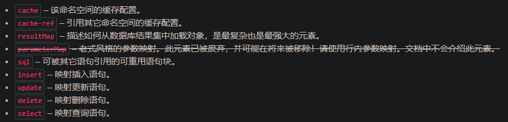
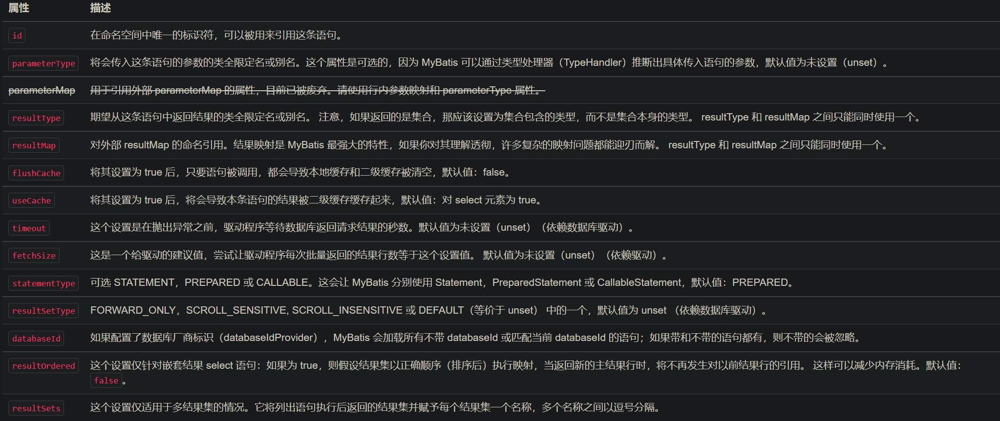
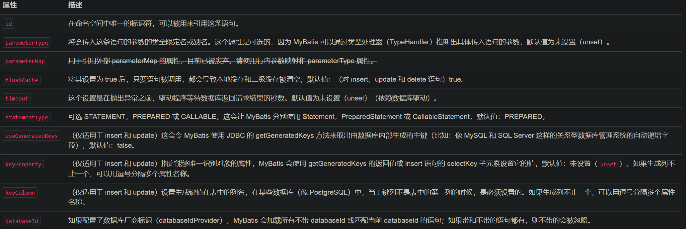
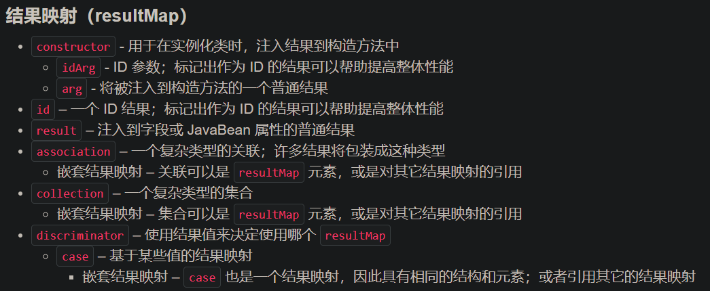
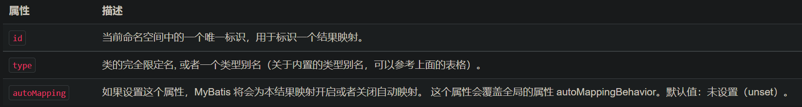
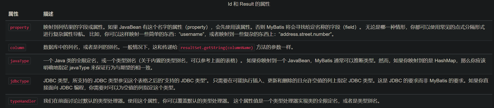
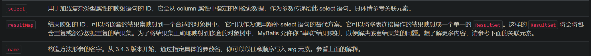
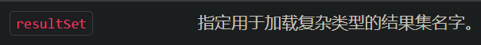

# 基本概念

---

开篇之前，先了解一些基本概念。

## POJO

> Plain old Java object 或 Plain Ordinary Java Object
> 简单旧java对象 或 简单普通的java对象

POJO突出一个特点——“简单”，在遵守基础的java语言规范的前提下不实现任何多余的功能，它所进行的工作也就是在持久层访问数据库时作为一个映射表而已。

## JavaBean

JavaBean是可序列化的POJO，它在POJO的基础上提供了扩展性，因此 JavaBean 也成为了一个组件、而不再是一个简单的java对象了。可以实现接口、扩展类、使用框架。

## DAO

全称：data access object，数据访问对象，一个抽象接口对象。

作用：对数据库（持久化数据）进行访问。

## DTO

全称：data transfer object，数据传输对象，此对象主要工作：完成数据的传输。

在两个线程中携带数据的对象。

DTO是一个简单对象，它仅具备数据对象的基本行为，存储、检索、序列化和反序列化自己的数据，不应该包含任何业务逻辑。

# 映射器

---

MyBatis 的真正强大在于它的语句映射，由于它的异常强大，映射器的 XML 文件就显得相对简单。
MyBatis 致力于减少使用成本，让用户能更专注于 SQL 代码。

SQL 映射文件只有很少的几个顶级元素（按照应被定义的顺序列出）：



---

## select

一个简单查询的 select 元素是非常简单的。

```xml
<select id="selectPerson" parameterType="int" resultType="hashmap">
  SELECT * FROM PERSON WHERE ID = #{id}
</select>
```

这个语句名为 selectPerson，接受一个 int（或 Integer）类型的参数，并返回一个 HashMap 类型的对象。
其中的键是列名，值便是结果行中的对应值。

select 元素允许你配置很多属性来配置每条语句的行为细节。

```xml
<select
  id="selectPerson"
  parameterType="int"
  parameterMap="deprecated"
  resultType="hashmap"
  resultMap="personResultMap"
  flushCache="false"
  useCache="true"
  timeout="10"
  fetchSize="256"
  statementType="PREPARED"
  resultSetType="FORWARD_ONLY">
```



---

## insert, update 和 delete

配置属性

```xml
<insert
  id="insertAuthor"
  parameterType="domain.blog.Author"
  flushCache="true"
  statementType="PREPARED"
  keyProperty=""
  keyColumn=""
  useGeneratedKeys=""
  timeout="20">

<update
  id="updateAuthor"
  parameterType="domain.blog.Author"
  flushCache="true"
  statementType="PREPARED"
  timeout="20">

<delete
  id="deleteAuthor"
  parameterType="domain.blog.Author"
  flushCache="true"
  statementType="PREPARED"
  timeout="20">
```

语句示例：

```xml
<insert id="insertAuthor">
  insert into Author (id,username,password,email,bio)
  values (#{id},#{username},#{password},#{email},#{bio})
</insert>

<update id="updateAuthor">
  update Author set
    username = #{username},
    password = #{password},
    email = #{email},
    bio = #{bio}
  where id = #{id}
</update>

<delete id="deleteAuthor">
  delete from Author where id = #{id}
</delete>
```



---

## sql

这个元素可以用来定义可重用的 SQL 代码片段，以便在其它语句中使用。

```xml
<sql id="userColumns"> ${alias}.id,${alias}.username,${alias}.password </sql>
```

```xml
<select id="selectUsers" resultType="map">
  select
    <include refid="userColumns"><property name="alias" value="t1"/></include>,
    <include refid="userColumns"><property name="alias" value="t2"/></include>
  from some_table t1
    cross join some_table t2
</select>
```


---

## 参数

> 参数：#{ id }，属性：${ id }

简单示例：

```xml
<select id="selectUsers" resultType="User">
  select id, username, password
  from users
  where id = #{id}
</select>
```

携带多个参数的示例：

```xml
<insert id="insertUser" parameterType="User">
  insert into users (id, username, password)
  values (#{id}, #{username}, #{password})
</insert>
```

---

**字符串替换**

原本select数据时，需要：

```java
@Select("select * from user where id = #{id}")
User findById(@Param("id") long id);

@Select("select * from user where name = #{name}")
User findByName(@Param("name") String name);

@Select("select * from user where email = #{email}")
User findByEmail(@Param("email") String email);
```

使用字符串替换：

```java
@Select("select * from user where ${column} = #{value}")
User findByColumn(@Param("column") String column, @Param("value") String value);
```

其中 `${column}` 会被直接替换，而 `#{value}` 会使用 `?` 预处理。

用这种方式接受用户的输入，并用作语句参数是不安全的，会导致潜在的 SQL 注入攻击。因此，要么不允许用户输入这些字段，要么自行转义并检验这些参数。


---

## 结果映射

ResultMap 的设计思想是，对简单的语句做到零配置，对于复杂一点的语句，只需要描述语句之间的关系就行了。

> `resultMap` 元素是 MyBatis 中最重要最强大的元素。

一个简单映射语句的示例：（但并没有显示指定结果映射）

```xml
<select id="selectUsers" resultType="map">
  select id, username, hashedPassword
  from some_table
  where id = #{id}
</select>
```

上述语句只是简单地将所有的列映射到 `HashMap` 的键上，这由 `resultType` 属性指定。

HashMap 并不是一个很好的领域模型。你的程序更可能会使用 JavaBean 或 POJO（Plain Old Java Objects，普通老式 Java 对象）作为领域模型。MyBatis 对两者都提供了支持。

将 JavaBean 映射到 ResultSet：

```xml
<select id="selectUsers" resultType="com.someapp.model.User">
  select id, username, hashedPassword
  from some_table
  where id = #{id}
</select>
```

JavaBean示例：

```java
package com.someapp.model;
public class User {
  private int id;
  private String username;
  private String hashedPassword;

  public int getId() {
    return id;
  }
  public void setId(int id) {
    this.id = id;
  }
  public String getUsername() {
    return username;
  }
  public void setUsername(String username) {
    this.username = username;
  }
  public String getHashedPassword() {
    return hashedPassword;
  }
  public void setHashedPassword(String hashedPassword) {
    this.hashedPassword = hashedPassword;
  }
}
```

很显然，并不是所有情况都需要我们显示的去配置`ResultMap`，但还是看一下吧：

```xml
<resultMap id="userResultMap" type="User">
  <id property="id" column="user_id" />
  <result property="username" column="user_name"/>
  <result property="password" column="hashed_password"/>
</resultMap>
```

然后在引用它的语句中设置 `resultMap` 属性就行了：

```xml
<select id="selectUsers" resultMap="userResultMap">
  select user_id, user_name, hashed_password
  from some_table
  where id = #{id}
</select>
```

> 显然，结果映射就是将语句中的`column`与`property`对应，以进行映射（键值对）。

---

## 高级结果映射

现在看一个复杂的 select 语句：

```xml 
<!-- 非常复杂的语句 -->
<select id="selectBlogDetails" resultMap="detailedBlogResultMap">
  select
       B.id as blog_id,
       B.title as blog_title,
       B.author_id as blog_author_id,
       A.id as author_id,
       A.username as author_username,
       A.password as author_password,
       A.email as author_email,
       A.bio as author_bio,
       A.favourite_section as author_favourite_section,
       P.id as post_id,
       P.blog_id as post_blog_id,
       P.author_id as post_author_id,
       P.created_on as post_created_on,
       P.section as post_section,
       P.subject as post_subject,
       P.draft as draft,
       P.body as post_body,
       C.id as comment_id,
       C.post_id as comment_post_id,
       C.name as comment_name,
       C.comment as comment_text,
       T.id as tag_id,
       T.name as tag_name
  from Blog B
       left outer join Author A on B.author_id = A.id
       left outer join Post P on B.id = P.blog_id
       left outer join Comment C on P.id = C.post_id
       left outer join Post_Tag PT on PT.post_id = P.id
       left outer join Tag T on PT.tag_id = T.id
  where B.id = #{id}
</select>
```

把它映射到一个智能的对象模型：

```xml
<!-- 非常复杂的结果映射 -->
<resultMap id="detailedBlogResultMap" type="Blog">
  <constructor>
    <idArg column="blog_id" javaType="int"/>
  </constructor>
  <result property="title" column="blog_title"/>
  <association property="author" javaType="Author">
    <id property="id" column="author_id"/>
    <result property="username" column="author_username"/>
    <result property="password" column="author_password"/>
    <result property="email" column="author_email"/>
    <result property="bio" column="author_bio"/>
    <result property="favouriteSection" column="author_favourite_section"/>
  </association>
  <collection property="posts" ofType="Post">
    <id property="id" column="post_id"/>
    <result property="subject" column="post_subject"/>
    <association property="author" javaType="Author"/>
    <collection property="comments" ofType="Comment">
      <id property="id" column="comment_id"/>
    </collection>
    <collection property="tags" ofType="Tag" >
      <id property="id" column="tag_id"/>
    </collection>
    <discriminator javaType="int" column="draft">
      <case value="1" resultType="DraftPost"/>
    </discriminator>
  </collection>
</resultMap>
```

> 更多的键值对--意味着--更多的映射语句，为了区分数据之间的特性，又需要定义新的子元素

---

下面是`resultMap` 元素的概念视图。



---

从第一个元素开始分析这个复杂的映射示例

1、`ResultMap`的属性列表



2、 **id & result**

```xml
<id property="id" column="post_id"/>
<result property="subject" column="post_subject"/>
```



result元素对数据库的列值进行了映射；而id元素是特殊的result元素，其中的属性可以作为对象的标识符。

3、构造方法—— **constructor**

构造方法注入允许你在初始化时为类设置属性的值。

有参构造方法示例：

```java
public class User {
   //...
   public User(Integer id, String username, int age) {
     //...
  }
//...
}
```

按参数顺序将结果注入构造方法：

```xml
<constructor>
   <idArg column="id" javaType="int"/>
   <arg column="username" javaType="String"/>
   <arg column="age" javaType="_int"/>
</constructor>
```

按名字注入、无视初始顺序：

```xml
<constructor>
   <idArg column="id" javaType="int" name="id" />
   <arg column="age" javaType="_int" name="age" />
   <arg column="username" javaType="String" name="username" />
</constructor>
```

其余属性



## 级联

---

级联是数据库实体概念，可理解为实体之间的联系，定义为：多个对象之间的映射关系。级联是一种映射关系，在一定情况下，级联可以提高系统内的管理效率。

在`MyBatis`中，有 3种级联。

- 鉴别器（discriminator）：根据所得条件确定二者的映射关系。

  > 根据不同的性别分配不同的信息。男对应男厕所、女对应女厕所。

- 一对一（association）：对象间一对一的映射关系。

  > 一个公民对应一个身份证号。

- 一对多（collection）：对象间一对多的映射关系。

  > 一个班主任管理班级内的所有同学。

## association

关联（一对一）

```xml
<association property="author" column="blog_author_id" javaType="Author">
  <id property="id" column="author_id"/>
  <result property="username" column="author_username"/>
</association>
```

MyBatis 有两种不同的方式加载关联：

- 嵌套 Select 查询：通过执行另外一个 SQL 映射语句来加载期望的复杂类型。
- 嵌套结果映射：使用嵌套的结果映射来处理连接结果的重复子集。

### 关联的嵌套 Select 查询

示例：

```xml
<resultMap id="blogResult" type="Blog">
  <association property="author" column="author_id" javaType="Author" select="selectAuthor"/>
</resultMap>

<select id="selectBlog" resultMap="blogResult">
  SELECT * FROM BLOG WHERE ID = #{id}
</select>

<select id="selectAuthor" resultType="Author">
  SELECT * FROM AUTHOR WHERE ID = #{id}
</select>
```

有两个 select 查询语句：一个用来加载博客（Blog），另外一个用来加载作者（Author），而且博客的结果映射描述了应该使用 `selectAuthor` 语句加载它的 author 属性。其它所有的属性将会被自动加载，只要它们的列名和属性名相匹配。

这种方式虽然很简单，但在大型数据集或大型数据表上表现不佳。这个问题被称为“N+1 查询问题”。 概括地讲，N+1 查询问题是这样子的：

- 你执行了一个单独的 SQL 语句来获取结果的一个列表（就是“+1”）。
- 对列表返回的每条记录，你执行一个 select 查询语句来为每条记录加载详细信息（就是“N”）。


### 关联的嵌套结果映射

下面的例子则是一个非常简单的例子，用于演示嵌套结果映射如何工作

```xml
<select id="selectBlog" resultMap="blogResult">
  select
    B.id            as blog_id,
    B.title         as blog_title,
    B.author_id     as blog_author_id,
    A.id            as author_id,
    A.username      as author_username,
    A.password      as author_password,
    A.email         as author_email,
    A.bio           as author_bio
  from Blog B left outer join Author A on B.author_id = A.id
  where B.id = #{id}
</select>
```

现在我们可以映射这个结果

```xml
<resultMap id="blogResult" type="Blog">
  <id property="id" column="blog_id" />
  <result property="title" column="blog_title"/>
  <association property="author" column="blog_author_id" javaType="Author" resultMap="authorResult"/>
</resultMap>

<resultMap id="authorResult" type="Author">
  <id property="id" column="author_id"/>
  <result property="username" column="author_username"/>
  <result property="password" column="author_password"/>
  <result property="email" column="author_email"/>
  <result property="bio" column="author_bio"/>
</resultMap>
```

上面使用了外部的结果映射元素来映射关联

下面直接将结果映射作为子元素嵌套在内

```xml
<resultMap id="blogResult" type="Blog">
  <id property="id" column="blog_id" />
  <result property="title" column="blog_title"/>
  <association property="author" javaType="Author">
    <id property="id" column="author_id"/>
    <result property="username" column="author_username"/>
    <result property="password" column="author_password"/>
    <result property="email" column="author_email"/>
    <result property="bio" column="author_bio"/>
  </association>
</resultMap>
```

那如果博客（blog）有一个共同作者（co-author）该怎么办？select 语句看起来会是这样的：

```xml
<select id="selectBlog" resultMap="blogResult">
  select
    B.id            as blog_id,
    B.title         as blog_title,
    A.id            as author_id,
    A.username      as author_username,
    A.password      as author_password,
    A.email         as author_email,
    A.bio           as author_bio,
    CA.id           as co_author_id,
    CA.username     as co_author_username,
    CA.password     as co_author_password,
    CA.email        as co_author_email,
    CA.bio          as co_author_bio
  from Blog B
  left outer join Author A on B.author_id = A.id
  left outer join Author CA on B.co_author_id = CA.id
  where B.id = #{id}
</select>
```

Author 的结果映射定义如下

```xml
<resultMap id="authorResult" type="Author">
  <id property="id" column="author_id"/>
  <result property="username" column="author_username"/>
  <result property="password" column="author_password"/>
  <result property="email" column="author_email"/>
  <result property="bio" column="author_bio"/>
</resultMap>
```

由于结果中的列名与结果映射中的列名不同。你需要指定 `columnPrefix` 以便重复使用该结果映射来映射 co-author 的结果。

```xml
<resultMap id="blogResult" type="Blog">
  <id property="id" column="blog_id" />
  <result property="title" column="blog_title"/>
  <association property="author"
    resultMap="authorResult" />
  <association property="coAuthor"
    resultMap="authorResult"
    columnPrefix="co_" />
</resultMap>
```


### 关联的多结果集（ResultSet）



从版本 3.2.3 开始，MyBatis 提供了另一种解决 N+1 查询问题的方法。

只访问数据库一次就能获得相关数据。

在例子中，存储过程执行下面的查询并返回两个结果集

```sql
SELECT * FROM BLOG WHERE ID = #{id}

SELECT * FROM AUTHOR WHERE ID = #{id}
```

在映射语句中，必须通过 `resultSets` 属性为每个结果集指定一个名字，多个名字使用逗号隔开。

```xml
<select id="selectBlog" resultSets="blogs,authors" resultMap="blogResult" statementType="CALLABLE">
  {call getBlogsAndAuthors(#{id,jdbcType=INTEGER,mode=IN})}
</select>
```

这样就可以指定使用 “authors” 结果集的数据来填充 “author” 关联

```xml
<resultMap id="blogResult" type="Blog">
  <id property="id" column="id" />
  <result property="title" column="title"/>
  <association property="author" javaType="Author" resultSet="authors" column="author_id" foreignColumn="id">
    <id property="id" column="id"/>
    <result property="username" column="username"/>
    <result property="password" column="password"/>
    <result property="email" column="email"/>
    <result property="bio" column="bio"/>
  </association>
</resultMap>
```

再解释一下N+1：

多结果集将所有查询结果放在了一个集合中，并使用属性为其中承载的每一个查询结果进行了命名标记，接下来在调用结果的时候，就会像点名一样、直接调用被点名的结果，而不会执行全部的sql语句，从而提高性能。

## collection

集合（一对多）

```xml
<collection property="posts" ofType="domain.blog.Post">
  <id property="id" column="post_id"/>
  <result property="subject" column="post_subject"/>
  <result property="body" column="post_body"/>
</collection>
```

一个博客（Blog）只有一个作者（Author)。但一个博客有很多文章（Post)。 在博客类中，这可以用下面的写法来表示

```java
private List<Post> posts;
```

和关联元素一样，我们可以使用嵌套 Select 查询，或基于连接的嵌套结果映射集合。

### 集合的嵌套Select查询

示例：

```xml
<resultMap id="blogResult" type="Blog">
  <collection property="posts" javaType="ArrayList" column="id" ofType="Post" select="selectPostsForBlog"/>
</resultMap>

<select id="selectBlog" resultMap="blogResult">
  SELECT * FROM BLOG WHERE ID = #{id}
</select>

<select id="selectPostsForBlog" resultType="Post">
  SELECT * FROM POST WHERE BLOG_ID = #{id}
</select>
```

```xml
<collection property="posts" javaType="ArrayList" column="id" ofType="Post" select="selectPostsForBlog"/>
```

 “ofType” 属性：它用来将 JavaBean（或字段）属性的类型和集合存储的类型区分开来。

读作： “posts 是一个存储 Post 的 ArrayList 集合”

### 集合的嵌套结果映射

除了新增的 “ofType” 属性，它和关联的完全相同。

对应的 SQL 语句：

```xml
<select id="selectBlog" resultMap="blogResult">
  select
  B.id as blog_id,
  B.title as blog_title,
  B.author_id as blog_author_id,
  P.id as post_id,
  P.subject as post_subject,
  P.body as post_body,
  from Blog B
  left outer join Post P on B.id = P.blog_id
  where B.id = #{id}
</select>
```

需要进行的连接配置：

```xml
<resultMap id="blogResult" type="Blog">
  <id property="id" column="blog_id" />
  <result property="title" column="blog_title"/>
  <collection property="posts" ofType="Post">
    <id property="id" column="post_id"/>
    <result property="subject" column="post_subject"/>
    <result property="body" column="post_body"/>
  </collection>
</resultMap>
```

等价：

```xml
<resultMap id="blogResult" type="Blog">
  <id property="id" column="blog_id" />
  <result property="title" column="blog_title"/>
  <collection property="posts" ofType="Post" resultMap="blogPostResult" columnPrefix="post_"/>
</resultMap>

<resultMap id="blogPostResult" type="Post">
  <id property="id" column="id"/>
  <result property="subject" column="subject"/>
  <result property="body" column="body"/>
</resultMap>
```

### 集合的多结果集（ResultSet）

执行两个查询并返回两个结果集

```sql
SELECT * FROM BLOG WHERE ID = #{id}

SELECT * FROM POST WHERE BLOG_ID = #{id}
```

在映射语句中，必须通过 `resultSets` 属性为每个结果集指定一个名字，多个名字使用逗号隔开。

```xml
<select id="selectBlog" resultSets="blogs,posts" resultMap="blogResult">
  {call getBlogsAndPosts(#{id,jdbcType=INTEGER,mode=IN})}
</select>
```

指定 “posts” 集合将会使用存储在 “posts” 结果集中的数据进行填充：

```xml
<resultMap id="blogResult" type="Blog">
  <id property="id" column="id" />
  <result property="title" column="title"/>
  <collection property="posts" ofType="Post" resultSet="posts" column="id" foreignColumn="blog_id">
    <id property="id" column="id"/>
    <result property="subject" column="subject"/>
    <result property="body" column="body"/>
  </collection>
</resultMap>
```

## discriminator

鉴别器

```xml
<discriminator javaType="int" column="draft">
  <case value="1" resultType="DraftPost"/>
</discriminator>
```

它很像 Java 语言中的 switch 语句。

一个鉴别器的定义需要指定 column 和 javaType 属性。

> column 指定了 MyBatis 查询被比较值的地方。而 javaType 用来确保使用正确的相等测试。

```xml
<resultMap id="vehicleResult" type="Vehicle">
  <id property="id" column="id" />
  <result property="vin" column="vin"/>
  <result property="year" column="year"/>
  <result property="make" column="make"/>
  <result property="model" column="model"/>
  <result property="color" column="color"/>
  <discriminator javaType="int" column="vehicle_type">
    <case value="1" resultMap="carResult"/>
    <case value="2" resultMap="truckResult"/>
    <case value="3" resultMap="vanResult"/>
    <case value="4" resultMap="suvResult"/>
  </discriminator>
</resultMap>
```

如果它匹配任意一个鉴别器的 case，就会使用这个 case 指定的结果映射，剩余的结果映射将被忽略。

如果不能匹配任何一个 case，MyBatis 就只会使用鉴别器块外定义的结果映射。

典例：

```xml
<resultMap id="vehicleResult" type="Vehicle">
  <id property="id" column="id" />
  <result property="vin" column="vin"/>
  <result property="year" column="year"/>
  <result property="make" column="make"/>
  <result property="model" column="model"/>
  <result property="color" column="color"/>
  <discriminator javaType="int" column="vehicle_type">
    <case value="1" resultType="carResult">
      <result property="doorCount" column="door_count" />
    </case>
    <case value="2" resultType="truckResult">
      <result property="boxSize" column="box_size" />
      <result property="extendedCab" column="extended_cab" />
    </case>
    <case value="3" resultType="vanResult">
      <result property="powerSlidingDoor" column="power_sliding_door" />
    </case>
    <case value="4" resultType="suvResult">
      <result property="allWheelDrive" column="all_wheel_drive" />
    </case>
  </discriminator>
</resultMap>
```

---

## 自动映射

当自动映射查询结果时，MyBatis 会获取结果中返回的列名并在 Java 类中查找相同名字的属性（忽略大小写）。

> 通常数据库列使用大写字母组成的单词命名，单词间用下划线分隔；而 Java 属性一般遵循驼峰命名法约定。为了在这两种命名方式之间启用自动映射，需要将 `mapUnderscoreToCamelCase` 设置为 true。

示例

```xml
<select id="selectUsers" resultMap="userResultMap">
  select
    user_id             as "id",
    user_name           as "userName",
    hashed_password
  from some_table
  where id = #{id}
</select>
```

```xml
<resultMap id="userResultMap" type="User">
  <result property="password" column="hashed_password"/>
</resultMap>
```

很显然，未在结果映射中进行的自定义配置，将会被系统采取自动映射。

> 在自动映射处理完毕后，再处理手动映射。

**有三种自动映射等级**：

- `NONE` - 禁用自动映射。仅对手动映射的属性进行映射。
- `PARTIAL` - 对除在内部定义了嵌套结果映射（也就是连接的属性）以外的属性进行映射
- `FULL` - 自动映射所有属性。

无论设置的自动映射等级是哪种，你都可以通过在结果映射上设置 `autoMapping` 属性来为指定的结果映射设置启用/禁用自动映射。

```xml
<resultMap id="userResultMap" type="User" autoMapping="false">
  <result property="password" column="hashed_password"/>
</resultMap>
```

---

## 缓存

> MyBatis 内置了一个强大的事务性查询缓存机制，它可以非常方便地配置和定制。

默认情况下，只启用了本地的会话缓存，它仅仅对一个会话中的数据进行缓存。 

> 一级缓存是在 SqlSession 上的缓存，二级缓存是在 SqlSessionFactory 上的缓存，默认情况采用的是一级缓存。
>
> 二级缓存是事务性的。这意味着，当 SqlSession 完成并提交时，或是完成并回滚，但没有执行 flushCache=true 的 insert/delete/update 语句时，缓存会获得更新。

要启用全局的二级缓存，只需要在你的 SQL 映射文件中添加一行：

```xml
<cache/>
```

效果如下:

- 映射语句文件中的所有 select 语句的结果将会被缓存。
- 映射语句文件中的所有 insert、update 和 delete 语句会刷新缓存。
- 缓存会使用LRU（ Least Recently Used）算法（清除策略）来清除不需要的缓存。
- 缓存不会定时进行刷新（也就是说，没有刷新间隔）。
- 缓存会保存列表或对象（无论查询方法返回哪种）的 1024 个引用。
- 缓存会被视为读/写缓存，这意味着获取到的对象并不是共享的，可以安全地被调用者修改，而不干扰其他调用者或线程所做的潜在修改。

缓存只作用于 cache 标签所在的映射文件中的语句。

> 如果你混合使用 Java API 和 XML 映射文件，在共用接口中的语句将不会被默认缓存。
>
> 所以需要使用 @CacheNamespaceRef 注解指定缓存作用域。

也可以手动定义缓存：

```xml
<cache
  eviction="FIFO"
  flushInterval="60000"
  size="512"
  readOnly="true"/>
```

> 此配置将创建一个 FIFO 缓存，每隔 60 秒刷新，最多可以存储结果对象或列表的 512 个引用，而且返回的对象被认为是只读的，因此对它们进行修改可能会在不同线程中的调用者产生冲突。

1、可用的清除策略有：

- `LRU` – 最近最少使用：移除最长时间不被使用的对象。
- `FIFO` – 先进先出：按对象进入缓存的顺序来移除它们。
- `SOFT` – 软引用：基于垃圾回收器状态和软引用规则移除对象。
- `WEAK` – 弱引用：更积极地基于垃圾收集器状态和弱引用规则移除对象。

2、flushInterval（刷新间隔）属性可以被设置为任意的正整数，设置的值应该是一个以毫秒为单位的合理时间量。 默认情况是不设置，也就是没有刷新间隔，缓存仅仅会在调用语句时刷新。

3、size（引用数目）属性可以被设置为任意正整数，要注意欲缓存对象的大小和运行环境中可用的内存资源。默认值是 1024。

4、readOnly（只读）属性可以被设置为 true 或 false。

> 只读的缓存会给所有调用者返回缓存对象的相同实例。 因此这些对象不能被修改。这就提供了可观的性能提升。
> 而可读写的缓存会（通过序列化）返回缓存对象的拷贝。 速度上会慢一些，但是更安全，因此默认值是 false。

### 使用自定义缓存

```xml
<cache type="com.domain.something.MyCustomCache"/>
```

↑ 这个示例展示了如何使用一个适配器（自定义的缓存实现）。

> 虽然MyBatis有自己的缓存配置功能，但还是可以进行第三方自定缓存，为了消除歧义——使用名字适配器。
>
> 且MyBatis自己的缓存配置（如清除策略、可读或可读写等）不能应用于自定义缓存。

type 属性指定的类必须实现 org.apache.ibatis.cache.Cache 接口，且提供一个接受 String 参数作为 id 的构造器。

```java
public interface Cache {
  String getId();
  int getSize();
  void putObject(Object key, Object value);
  Object getObject(Object key);
  boolean hasKey(Object key);
  Object removeObject(Object key);
  void clear();
}
```

`MyCustomCache`类中需要添加公有的 JavaBean 属性。
这是为了对缓存进行配置，接着、会通过 cache 元素传递属性值。↓

```xml
<cache type="com.domain.something.MyCustomCache">
  <property name="cacheFile" value="/tmp/my-custom-cache.tmp"/>
</cache>
```

从版本 3.4.2 开始，MyBatis 已经支持在所有属性设置完毕之后，调用一个初始化方法。 如果想要使用这个特性，请在你的自定义缓存类里实现 `org.apache.ibatis.builder.InitializingObject` 接口。

```Java
public interface InitializingObject {
  void initialize() throws Exception;
}
```

缓存的配置和缓存实例会被绑定到 SQL 映射文件的命名空间中。 因此，同一命名空间中的所有语句和缓存将通过命名空间绑定在一起。

所以可以去控制哪条sql语句绑定缓存而哪条又不进行绑定。

```xml
<select ... flushCache="false" useCache="true"/>
<insert ... flushCache="true"/>
<update ... flushCache="true"/>
<delete ... flushCache="true"/>
```

既可以设置一个命名空间的作用范围，也可以让多个命名空间同时使用一个缓存规则。如下 ↓

### cache-ref

```xml
<cache-ref namespace="com.someone.application.data.SomeMapper"/>
```